# Laporan Tugas Modul 4
 
**Modul:** Firewall dan NAT  
**Kelompok:** 11 <br>
**Nama Anggota:**  
1. Athaya Khairani Adi 5024241007 
2. Hafidz Ulum Ramadhani 5024241014
3. Dhafin Ardra Madany 5024241054

---

## Daftar Isi

1. [Topologi Jaringan](#1-topologi-jaringan)  
2. [Penjelasan Perangkat](#2-penjelasan-perangkat)  
3. [Segmentasi Jaringan](#3-segmentasi-jaringan)  
4. [Tabel IP Address](#4-tabel-ip-address)  
5. [Konfigurasi Perangkat](#5-konfigurasi-perangkat)  
   - [5.1 MikroTik ISP](#51-mikrotik-isp)  
   - [5.2 FortiGate](#52-fortigate)  
   - [5.3 Cisco Router (vIOS)](#53-cisco-router-vios)  
   - [5.4 Ubuntu Server DMZ](#54-ubuntu-server-dmz)  
   - [5.5 Client LAN (TinyCore Linux)](#55-client-lan-tinycore-linux)  
   - [5.6 Client WAN (TinyCore Linux)](#56-client-wan-tinycore-linux)  
6. [Hasil Pengujian](#6-hasil-pengujian)  
7. [Analisis dan Kesimpulan](#7-analisis-dan-kesimpulan)  

---

## 1. Topologi Jaringan

Topologi yang digunakan pada praktikum ini terdiri atas empat zona jaringan utama, yaitu zona Internet, Outside Zone (WAN), DMZ Zone, dan LAN Zone. MikroTik berperan sebagai router ISP yang menghubungkan seluruh zona ke internet. FortiGate berfungsi sebagai firewall utama yang mengatur dan memfilter lalu lintas antar zona. Cisco Router (vIOS) menghubungkan FortiGate ke jaringan LAN internal. Ubuntu Server ditempatkan di zona DMZ sebagai web server, sementara TinyCore Linux digunakan sebagai perangkat klien baik di sisi LAN maupun WAN.

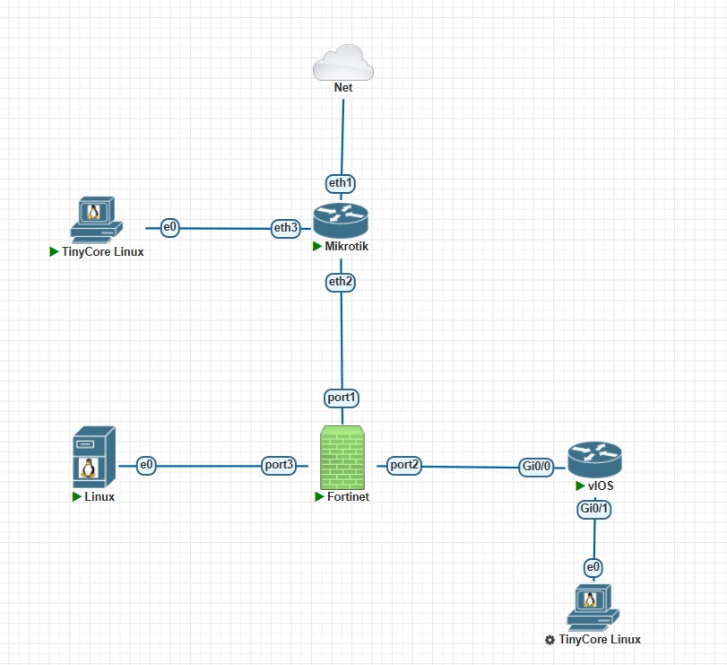

---

## 2. Penjelasan Perangkat

| No. | Perangkat | Fungsi |
|:---:|:----------|:-------|
| 1 | Cloud / Jaringan Lab | Menghubungkan simulasi PNETLab ke jaringan lab atau internet |
| 2 | MikroTik ISP | Berperan sebagai router ISP atau simulasi jaringan luar |
| 3 | FortiGate | Berperan sebagai firewall utama yang mengatur akses antara WAN, LAN, dan DMZ |
| 4 | Cisco Router (vIOS) | Berperan sebagai router internal menuju jaringan LAN |
| 5 | Client LAN (TinyCore Linux) | Klien internal yang berada di belakang Cisco Router |
| 6 | Client WAN (TinyCore Linux) | Klien dari sisi luar atau internet untuk menguji akses ke server DMZ |
| 7 | Ubuntu Server DMZ | Server web yang ditempatkan di zona DMZ |

---

## 3. Segmentasi Jaringan

Topologi ini terbagi menjadi beberapa segmen jaringan sebagai berikut.

| Segmen | Network | Keterangan |
|:-------|:--------|:-----------|
| Jaringan Lab / Internet | DHCP dari jaringan lab | Sumber koneksi luar |
| ISP ke FortiGate | 10.10.10.0/30 | Tautan antara MikroTik ISP dan FortiGate |
| Client WAN | 172.16.100.0/24 | Jaringan klien dari sisi luar |
| FortiGate ke Cisco | 10.20.20.0/30 | Tautan antara FortiGate dan Cisco Router |
| LAN | 192.168.10.0/24 | Jaringan internal klien |
| DMZ | 192.168.20.0/24 | Jaringan server DMZ |

---

## 4. Tabel IP Address

| Perangkat | Interface | IP Address | Gateway | Keterangan |
|:----------|:----------|:-----------|:--------|:-----------|
| MikroTik ISP | ether1 | DHCP Client (10.4.89.182/24) | 10.4.89.1 | Terhubung ke Cloud atau jaringan lab |
| MikroTik ISP | ether2 | 10.10.10.1/30 | - | Terhubung ke FortiGate port1 |
| MikroTik ISP | ether3 | 172.16.100.1/24 | - | Gateway untuk Client WAN |
| FortiGate | port1 | 10.10.10.2/30 | 10.10.10.1 | Interface WAN |
| FortiGate | port2 | 10.20.20.1/30 | - | Interface INSIDE ke Cisco |
| FortiGate | port3 | 192.168.20.1/24 | - | Interface DMZ |
| Cisco Router | G0/0 | 10.20.20.2/30 | - | Terhubung ke FortiGate port2 |
| Cisco Router | G0/1 | 192.168.10.1/24 | - | Gateway LAN |
| Client LAN (TinyCore) | eth0 | 192.168.10.10/24 | 192.168.10.1 | Klien internal |
| Client WAN (TinyCore) | eth0 | 172.16.100.10/24 | 172.16.100.1 | Klien luar |
| Ubuntu Server DMZ | eth0 | 192.168.20.10/24 | 192.168.20.1 | Web server DMZ |

---

## 5. Konfigurasi Perangkat

### 5.1 MikroTik ISP

MikroTik dikonfigurasi sebagai router ISP yang menghubungkan seluruh zona ke internet. Konfigurasi mencakup DHCP Client pada ether1, penetapan alamat IP pada ether2 dan ether3, NAT masquerade, serta rute statis menuju jaringan LAN dan DMZ melalui FortiGate.

**Konfigurasi IP Address dan Routing:**

```bash
# DHCP Client pada ether1
/ip dhcp-client add interface=ether1 disabled=no

# IP Address
/ip address add address=10.10.10.1/30 interface=ether2
/ip address add address=172.16.100.1/24 interface=ether3

# NAT Masquerade
/ip firewall nat add chain=srcnat out-interface=ether1 action=masquerade

# Static Route ke LAN dan DMZ via FortiGate
/ip route add dst-address=192.168.10.0/24 gateway=10.10.10.2
/ip route add dst-address=192.168.20.0/24 gateway=10.10.10.2
```

Hasil verifikasi konfigurasi IP address dan routing table pada MikroTik ditunjukkan pada gambar berikut.

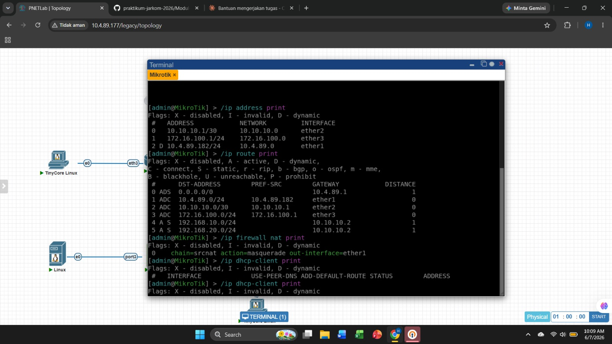

Gambar di atas memperlihatkan bahwa MikroTik telah memperoleh IP dinamis `10.4.89.182/24` pada ether1 melalui DHCP Client, IP statis `10.10.10.1/30` pada ether2, dan `172.16.100.1/24` pada ether3. Tabel routing menunjukkan dua rute statis aktif menuju `192.168.10.0/24` dan `192.168.20.0/24` via gateway `10.10.10.2`, serta NAT masquerade telah terpasang pada ether1.

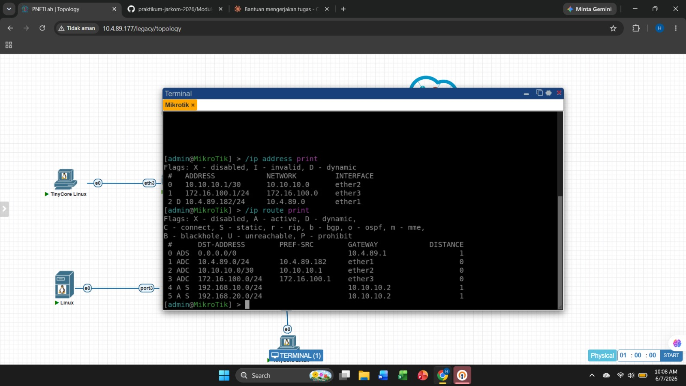

---

### 5.2 FortiGate

FortiGate dikonfigurasi sebagai firewall utama dengan tiga interface aktif, yaitu port1 sebagai WAN, port2 sebagai INSIDE menuju Cisco Router, dan port3 sebagai DMZ. Konfigurasi mencakup penetapan IP tiap interface, rute statis, address object, firewall policy, dan VIP untuk port forwarding.

**Konfigurasi Interface:**

```bash
config system interface
  edit port1
    set ip 10.10.10.2 255.255.255.252
    set allowaccess ping https ssh
  next
  edit port2
    set ip 10.20.20.1 255.255.255.252
    set allowaccess ping
  next
  edit port3
    set ip 192.168.20.1 255.255.255.0
    set allowaccess ping
  next
end
```

Hasil verifikasi konfigurasi interface FortiGate diperlihatkan pada gambar berikut.

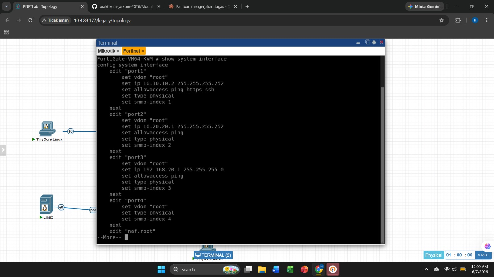

**Konfigurasi Routing:**

```bash
# Default route menuju MikroTik ISP
config router static
  edit 1
    set dst 0.0.0.0 0.0.0.0
    set gateway 10.10.10.1
    set device port1
  next
  # Static route menuju LAN via Cisco Router
  edit 2
    set dst 192.168.10.0 255.255.255.0
    set gateway 10.20.20.2
    set device port2
  next
end
```

Tabel routing FortiGate setelah konfigurasi ditampilkan pada gambar berikut.

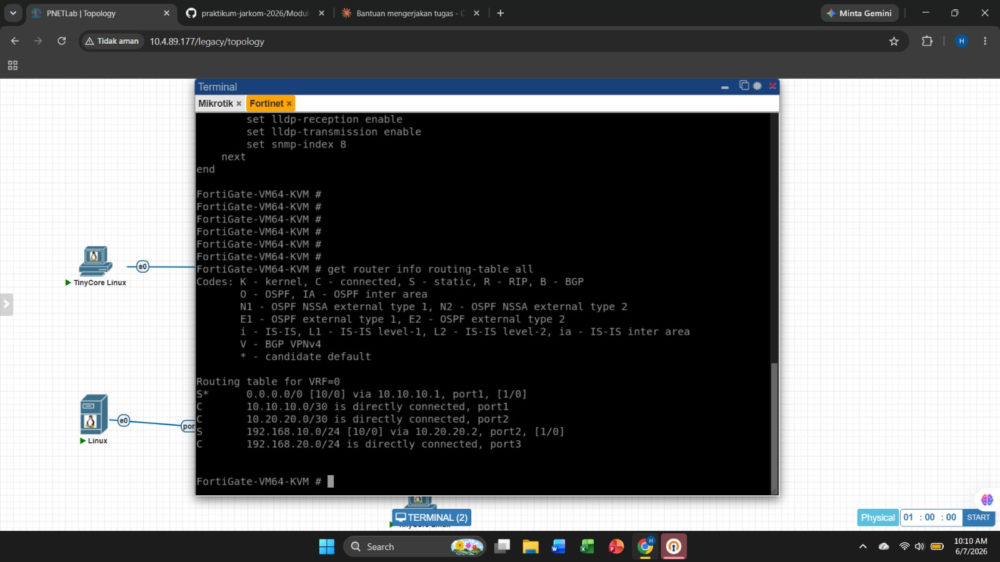

Gambar di atas memperlihatkan bahwa FortiGate memiliki default route menuju `10.10.10.1` melalui port1, rute statis menuju `192.168.10.0/24` via `10.20.20.2` melalui port2, serta jaringan `192.168.20.0/24` yang terhubung langsung pada port3.

**Konfigurasi Address Object:**

```bash
config firewall address
  edit "LAN"
    set subnet 192.168.10.0 255.255.255.0
  next
  edit "ServerDMZ"
    set subnet 192.168.20.10 255.255.255.255
  next
end
```

Daftar address object yang telah dikonfigurasi ditunjukkan pada gambar berikut.

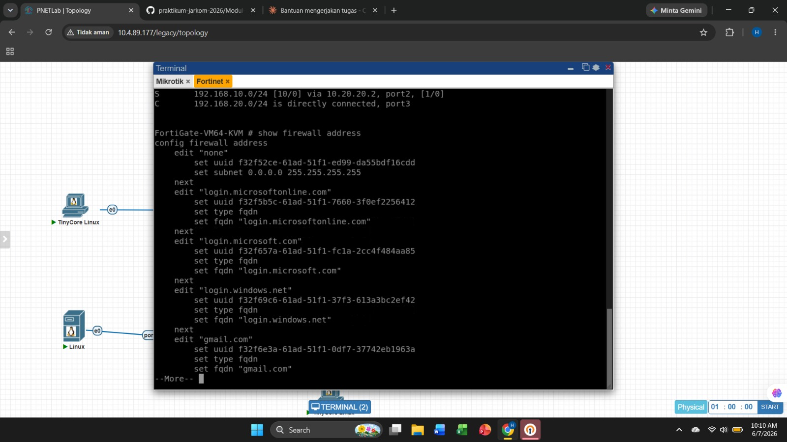

**Konfigurasi Firewall Policy:**

Tiga policy dibuat untuk mengatur lalu lintas antar zona, yaitu `LAN_to_WAN` dengan NAT aktif agar klien LAN dapat mengakses internet, `LAN_to_DMZ` tanpa NAT agar klien LAN dapat mengakses server DMZ secara langsung, serta `WAN_to_DMZ_HTTP` yang dikombinasikan dengan VIP untuk memberi akses klien WAN ke web server DMZ melalui IP FortiGate.

```bash
config firewall policy
  edit 1
    set name "LAN_to_WAN"
    set srcintf "port2"
    set dstintf "port1"
    set srcaddr "LAN"
    set dstaddr "all"
    set action accept
    set schedule "always"
    set service "ALL"
    set nat enable
  next
  edit 2
    set name "LAN_to_DMZ"
    set srcintf "port2"
    set dstintf "port3"
    set srcaddr "LAN"
    set dstaddr "ServerDMZ"
    set action accept
    set schedule "always"
    set service "ALL"
  next
  edit 3
    set name "WAN_to_DMZ_HTTP"
    set srcintf "port1"
    set dstintf "port3"
    set srcaddr "all"
    set dstaddr "VIP_DMZ"
    set action accept
    set schedule "always"
    set service "HTTP"
  next
  edit 4
    set name "DMZ_to_WAN"
    set srcintf "port3"
    set dstintf "port1"
    set action accept
    set srcaddr "all"
    set dstaddr "all"
    set schedule "always"
    set service "ALL"
    set nat enable
  next
end
```

Hasil konfigurasi firewall policy pada FortiGate diperlihatkan pada gambar berikut.

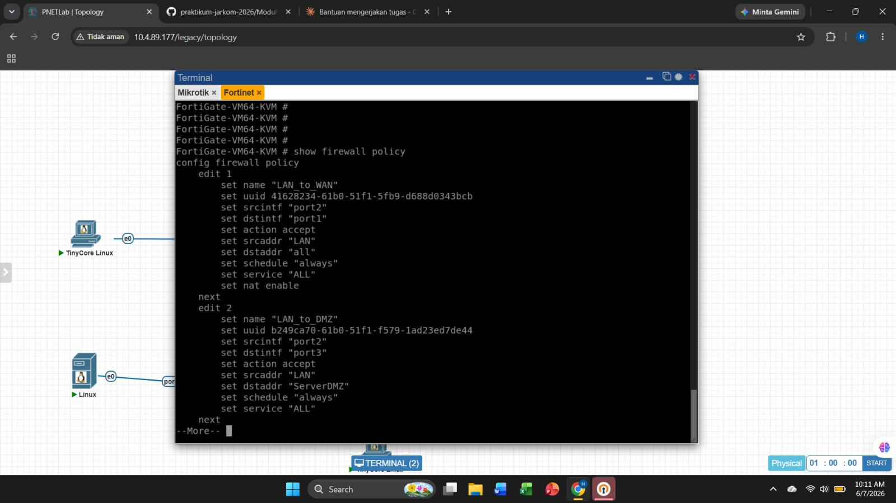

**Konfigurasi VIP (Virtual IP / Port Forwarding):**

VIP dikonfigurasi agar permintaan yang masuk ke IP FortiGate `10.10.10.2` pada port 80 diteruskan ke Ubuntu Server DMZ pada IP `192.168.20.10` port 80.

```bash
config firewall vip
  edit "VIP_DMZ"
    set extip 10.10.10.2
    set mappedip "192.168.20.10"
    set extintf "port1"
    set portforward enable
    set extport 80
    set mappedport 80
  next
end
```

Hasil konfigurasi VIP pada FortiGate ditunjukkan pada gambar berikut.

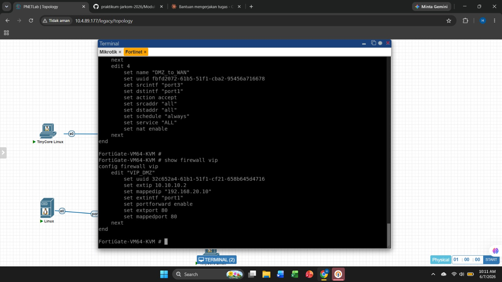

---

### 5.3 Cisco Router (vIOS)

Cisco Router dikonfigurasi dengan dua interface aktif, yaitu GigabitEthernet0/0 menuju FortiGate dan GigabitEthernet0/1 menuju jaringan LAN, serta sebuah default route menuju FortiGate.

**Konfigurasi Interface dan Routing:**

```bash
enable
configure terminal

interface GigabitEthernet0/0
  ip address 10.20.20.2 255.255.255.252
  no shutdown
exit

interface GigabitEthernet0/1
  ip address 192.168.10.1 255.255.255.0
  no shutdown
exit

ip route 0.0.0.0 0.0.0.0 10.20.20.1

copy running-config startup-config
```

Hasil verifikasi konfigurasi Cisco Router diperlihatkan pada gambar berikut.

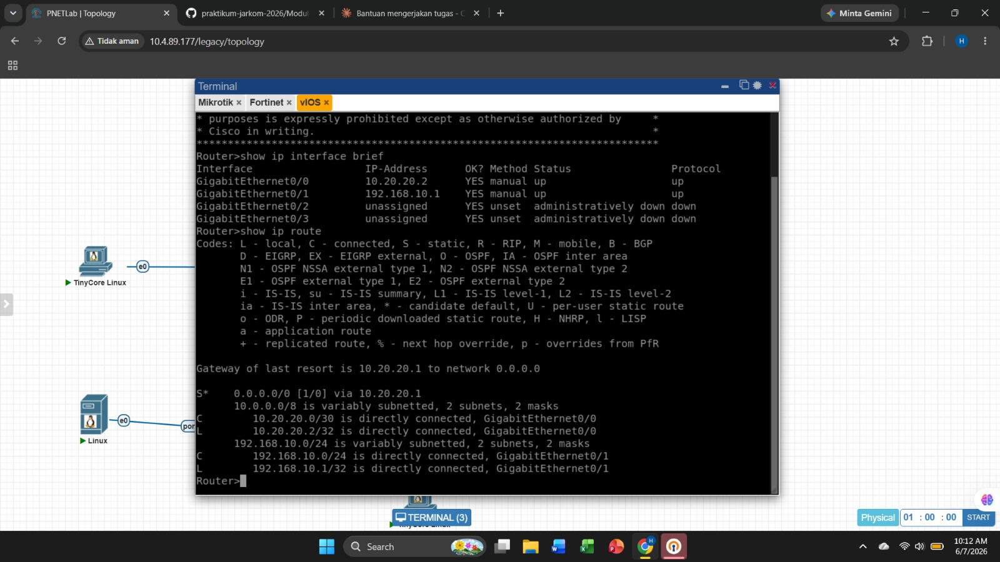

Gambar di atas memperlihatkan bahwa GigabitEthernet0/0 telah mendapatkan IP `10.20.20.2` dengan status up/up, GigabitEthernet0/1 mendapatkan IP `192.168.10.1` dengan status up/up, serta tabel routing menampilkan default route `0.0.0.0/0` via `10.20.20.1` yang aktif.

---

### 5.4 Ubuntu Server DMZ

Ubuntu Server dikonfigurasi dengan IP statis pada interface eth0, kemudian dilakukan instalasi Nginx sebagai web server. Halaman default Nginx diubah sesuai format yang ditetapkan pada modul.

**Konfigurasi IP Statis:**

```bash
# Edit file konfigurasi netplan
nano /etc/netplan/00-installer-config.yaml
```

Isi file konfigurasi:

```yaml
network:
  ethernets:
    eth0:
      addresses: [192.168.20.10/24]
      gateway4: 192.168.20.1
      nameservers:
        addresses: [8.8.8.8]
  version: 2
```

```bash
# Terapkan konfigurasi
netplan apply
```

**Instalasi dan Konfigurasi Nginx:**

```bash
apt update
apt install nginx -y

# Ubah halaman default
nano /var/www/html/index.html
```

Isi halaman web:

```html
<h1>Tumod_4_DMZ_Firewall_03-Kelompok11</h1>
```

```bash
# Aktifkan dan jalankan Nginx
service nginx start
service nginx status
```

Hasil konfigurasi dan status Nginx pada Ubuntu Server DMZ ditunjukkan pada gambar berikut.

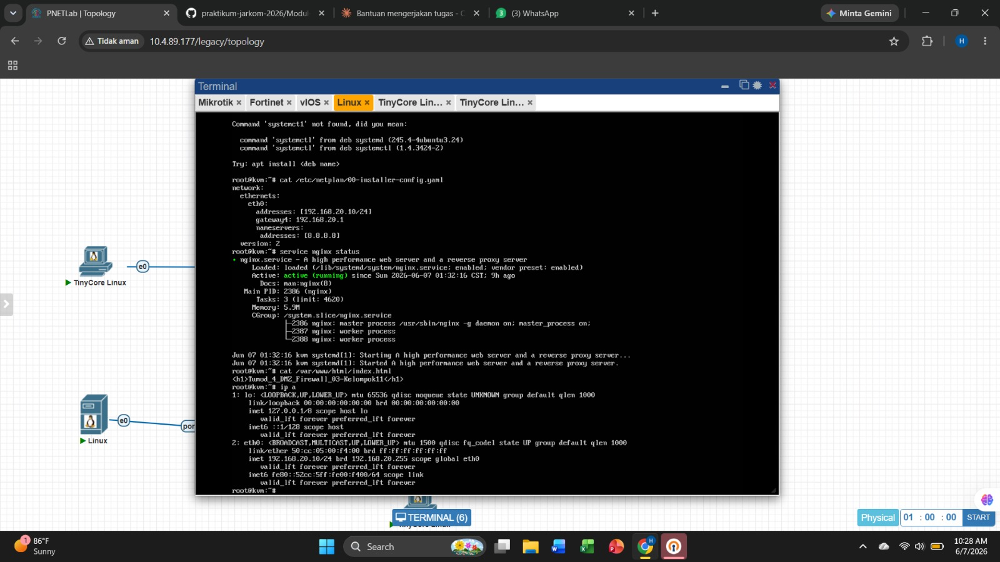

Gambar di atas memperlihatkan bahwa Nginx berstatus `active (running)`, IP statis `192.168.20.10/24` telah terpasang pada interface eth0, dan isi file `index.html` telah diubah menjadi `Tumod_4_DMZ_Firewall_03-Kelompok11`.

---

### 5.5 Client LAN (TinyCore Linux)

Client LAN dikonfigurasi dengan IP statis melalui terminal agar dapat berkomunikasi dengan Cisco Router dan mengakses jaringan DMZ maupun internet.

**Konfigurasi IP Address:**

```bash
sudo ifconfig eth0 192.168.10.10 netmask 255.255.255.0
sudo route add default gw 192.168.10.1
echo "nameserver 8.8.8.8" | sudo tee /etc/resolv.conf
```

---

### 5.6 Client WAN (TinyCore Linux)

Client WAN dikonfigurasi dengan IP statis yang berada dalam segmen jaringan ether3 MikroTik agar dapat mensimulasikan akses dari sisi internet.

**Konfigurasi IP Address:**

```bash
sudo ifconfig eth0 172.16.100.10 netmask 255.255.255.0
sudo route add default gw 172.16.100.1
echo "nameserver 8.8.8.8" | sudo tee /etc/resolv.conf
```

---

## 6. Hasil Pengujian

### Pengujian 1: Client LAN ke Gateway Cisco

**Perangkat asal:** Client LAN (TinyCore Linux, 192.168.10.10)  
**Tujuan:** Gateway Cisco Router (192.168.10.1)  
**Perintah:**
```bash
ping 192.168.10.1
```
**Hasil :** Reply

Pengujian ini memverifikasi bahwa Client LAN dapat menjangkau gateway-nya sendiri, yaitu Cisco Router, yang merupakan syarat dasar konektivitas jaringan LAN.

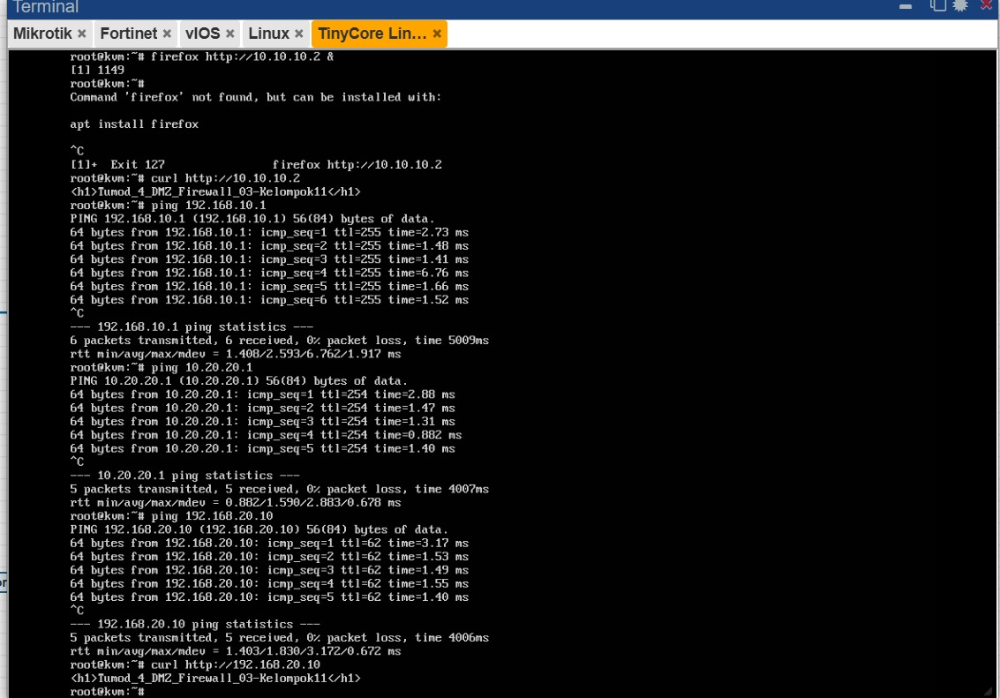

---

### Pengujian 2: Client LAN ke FortiGate

**Perangkat asal:** Client LAN (TinyCore Linux, 192.168.10.10)  
**Tujuan:** FortiGate port2 (10.20.20.1)  
**Perintah:**
```bash
ping 10.20.20.1
```
**Hasil :** Reply

Pengujian ini memverifikasi bahwa lalu lintas dari LAN dapat melewati Cisco Router dan menjangkau interface FortiGate yang menghadap ke LAN.


---

### Pengujian 3: Client LAN ke Server DMZ

**Perangkat asal:** Client LAN (TinyCore Linux, 192.168.10.10)  
**Tujuan:** Ubuntu Server DMZ (192.168.20.10)  
**Perintah:**
```bash
ping 192.168.20.10
```

**Hasil :** Reply

Pengujian ini memverifikasi bahwa firewall policy `LAN_to_DMZ` pada FortiGate telah mengizinkan lalu lintas ICMP dari zona LAN menuju zona DMZ.


---

### Pengujian 4: Client LAN Akses Web Server DMZ

**Perangkat asal:** Client LAN (TinyCore Linux, 192.168.10.10)  
**Tujuan:** Web server DMZ via IP langsung (http://192.168.20.10)  
**Perintah:**
```bash
curl http://192.168.20.10
```
**Hasil :** Halaman web `Tumod_4_DMZ_Firewall_03-Kelompok11` tampil  


> Sebelum pengujian akses web, lynx diinstal terlebih dahulu pada TinyCore Linux karena tidak tersedia secara default. Proses instalasi membutuhkan koneksi internet yang aktif, dibuktikan dengan ping ke 8.8.8.8 yang berhasil.

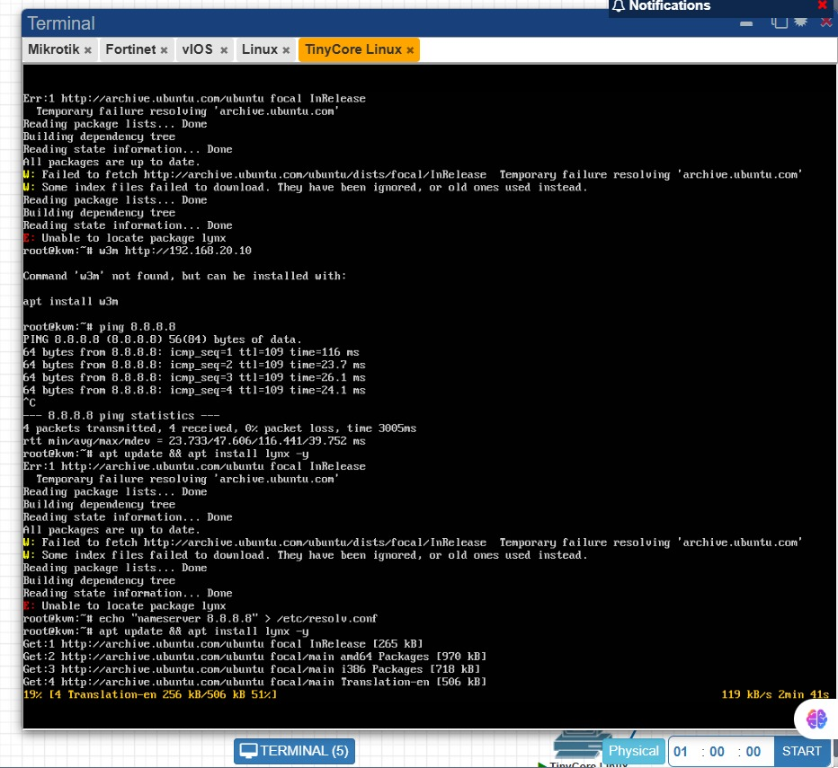

Pengujian ini memverifikasi bahwa Nginx aktif berjalan pada Ubuntu Server DMZ dan dapat diakses oleh klien LAN secara langsung melalui IP asli server.


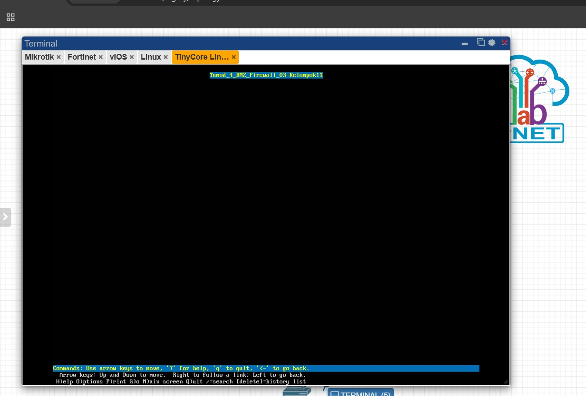

---

### Pengujian 5: Client WAN Ping ke MikroTik ISP

**Perangkat asal:** Client WAN (TinyCore Linux, 172.16.100.10)  
**Tujuan:** MikroTik ISP ether3 (172.16.100.1)  
**Perintah:**
```bash
ping 172.16.100.1
```

**Hasil :** Reply

Pengujian ini memverifikasi bahwa Client WAN terhubung dengan gateway-nya, yaitu interface ether3 MikroTik ISP.

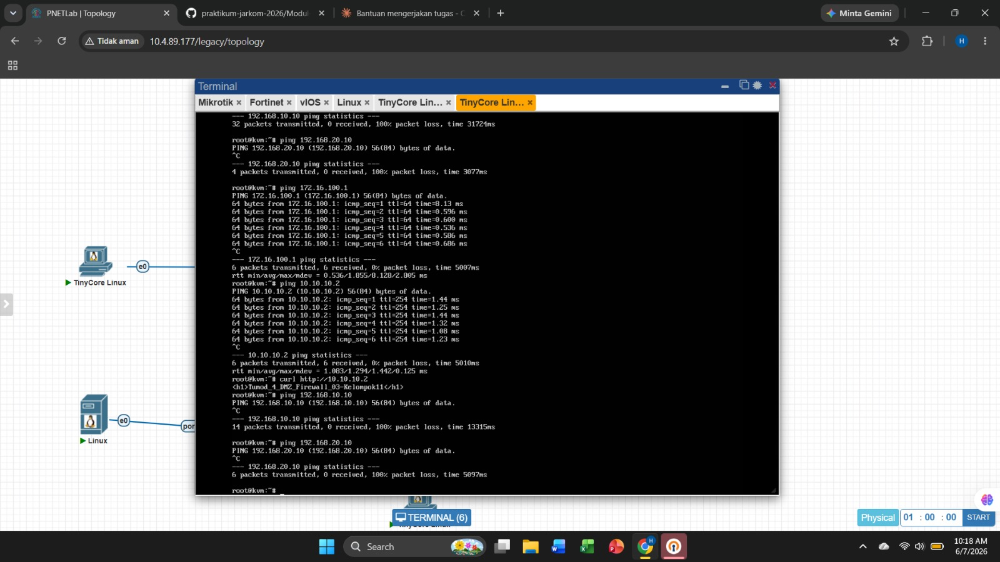

---

### Pengujian 6: Client WAN Ping ke FortiGate

**Perangkat asal:** Client WAN (TinyCore Linux, 172.16.100.10)  
**Tujuan:** FortiGate port1 / WAN (10.10.10.2)  
**Perintah:**
```bash
ping 10.10.10.2
```
 
**Hasil :** Reply

Pengujian ini memverifikasi bahwa Client WAN dapat menjangkau interface WAN FortiGate melalui jaringan MikroTik ISP.


---

### Pengujian 7: Client WAN Akses Web Server via VIP

**Perangkat asal:** Client WAN (TinyCore Linux, 172.16.100.10)  
**Tujuan:** FortiGate WAN IP sebagai VIP (http://10.10.10.2)  
**Perintah:**
```bash
curl http://10.10.10.2
```
**Hasil :** Halaman web `Tumod_4_DMZ_Firewall_03-Kelompok11` tampil  


Pengujian ini merupakan validasi utama konfigurasi VIP dan port forwarding. Permintaan HTTP yang dikirim ke `10.10.10.2` oleh FortiGate diteruskan ke `192.168.20.10` melalui mekanisme Destination NAT. Client WAN berhasil mengakses konten web server tanpa mengetahui IP asli server DMZ.


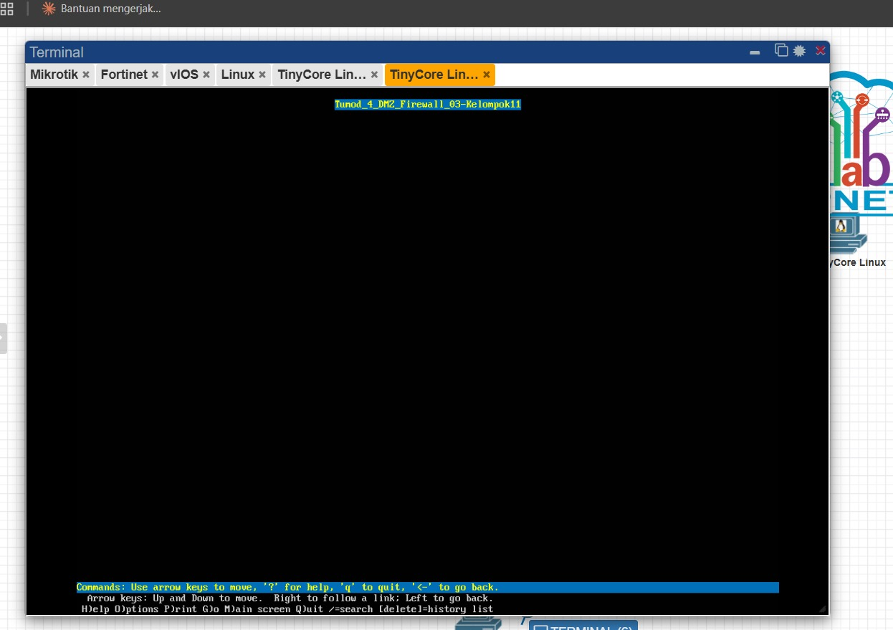

---

### Pengujian 8: Client WAN Ping ke Client LAN (Harus Gagal)

**Perangkat asal:** Client WAN (TinyCore Linux, 172.16.100.10)  
**Tujuan:** Client LAN (192.168.10.10)  
**Perintah:**
```bash
ping 192.168.10.10
```
**Hasil :** Timeout (diblokir firewall) ,100% packet loss


Tidak ada firewall policy yang mengizinkan lalu lintas dari zona WAN menuju zona LAN. FortiGate memblokir seluruh paket tersebut, sehingga Client WAN tidak dapat mengakses jaringan internal LAN. Hasil ini sesuai dengan prinsip desain DMZ yang memisahkan zona publik dari zona privat.


---

### Pengujian 9: Client WAN Ping ke IP Asli Server DMZ (Harus Gagal)

**Perangkat asal:** Client WAN (TinyCore Linux, 172.16.100.10)  
**Tujuan:** IP asli Ubuntu Server DMZ (192.168.20.10)  
**Perintah:**
```bash
ping 192.168.20.10
```
**Hasil :** Timeout (diblokir firewall) ,100% packet loss

Firewall policy `WAN_to_DMZ_HTTP` hanya mengizinkan protokol HTTP melalui VIP. Tidak ada policy yang mengizinkan ICMP dari WAN ke IP asli server DMZ. Hal ini memastikan bahwa server DMZ hanya dapat diakses melalui jalur yang telah ditentukan, yaitu melalui VIP pada port 80, sehingga lapisan keamanan tambahan terpenuhi.


---

### Pengujian 10: Server DMZ Ping ke Client LAN

**Perangkat asal:** Ubuntu Server DMZ (192.168.20.10)  
**Tujuan:** Client LAN (192.168.10.10)  
**Perintah:**
```bash
ping 192.168.10.10
```
**Hasil :** Timeout (diblokir firewall) ,100% packet loss

Ping dari Server DMZ ke Client LAN menunjukkan packet loss. Hal ini menandakan bahwa tidak ada firewall policy yang mengizinkan lalu lintas ICMP dari zona DMZ menuju zona LAN. 

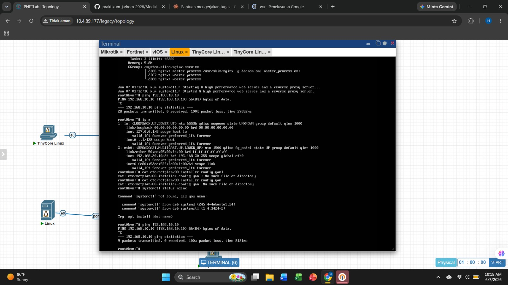

---

### Ringkasan Hasil Pengujian

| No. | Pengujian | Dari | Tujuan | Hasil |
|:---:|:----------|:-----|:-------|:-----:|
| 1 | Client LAN ke Gateway Cisco | 192.168.10.10 | 192.168.10.1 | Berhasil |
| 2 | Client LAN ke FortiGate | 192.168.10.10 | 10.20.20.1 | Berhasil |
| 3 | Client LAN ke Server DMZ | 192.168.10.10 | 192.168.20.10 | Berhasil |
| 4 | Client LAN akses web DMZ | 192.168.10.10 | http://192.168.20.10 | Berhasil |
| 5 | Client WAN ke MikroTik ISP | 172.16.100.10 | 172.16.100.1 | Berhasil |
| 6 | Client WAN ke FortiGate WAN | 172.16.100.10 | 10.10.10.2 | Berhasil |
| 7 | Client WAN akses web via VIP | 172.16.100.10 | http://10.10.10.2 | Berhasil |
| 8 | Client WAN ke Client LAN | 172.16.100.10 | 192.168.10.10 | Diblokir |
| 9 | Client WAN ke IP asli DMZ | 172.16.100.10 | 192.168.20.10 | Diblokir |
| 10 | Server DMZ ke Client LAN | 192.168.20.10 | 192.168.10.10 | Diblokir |

---

## 7. Analisis dan Kesimpulan

### 7.1 Analisis

Implementasi topologi DMZ Firewall pada praktikum ini berhasil mendemonstrasikan beberapa konsep penting dalam keamanan jaringan.

**Segmentasi Jaringan Berbasis Zona**

Penggunaan tiga zona berbeda, yaitu WAN, LAN, dan DMZ, memungkinkan penerapan kebijakan keamanan yang granular dan terpisah untuk setiap zona. FortiGate sebagai firewall utama menjadi titik kendali tunggal yang mengatur seluruh lalu lintas antar zona. Desain ini mencegah akses langsung dari zona publik ke zona privat, sehingga mengurangi permukaan serangan secara signifikan.

**Fungsi NAT dan Masquerade**

NAT masquerade pada MikroTik ISP memungkinkan seluruh perangkat di jaringan simulasi untuk mengakses internet menggunakan satu IP publik. Policy `LAN_to_WAN` pada FortiGate dengan NAT aktif memastikan bahwa klien LAN dapat mengakses internet dengan identitas IP FortiGate, bukan IP internal mereka.

**Fungsi VIP sebagai Port Forwarding**

VIP pada FortiGate berfungsi sebagai mekanisme Destination NAT yang menerjemahkan permintaan yang masuk ke IP publik `10.10.10.2:80` menjadi permintaan ke IP privat server DMZ `192.168.20.10:80`. Mekanisme ini memungkinkan server DMZ dapat diakses dari internet tanpa mengekspos IP aslinya, sehingga memberikan lapisan keamanan tambahan bagi server.

**Efektivitas Firewall Policy**

Hasil pengujian nomor 8, 9, dan 10 membuktikan bahwa kebijakan default-deny pada FortiGate berfungsi dengan baik. Lalu lintas yang tidak diizinkan oleh policy akan diblokir secara otomatis. Client WAN tidak dapat mengakses jaringan LAN maupun IP asli server DMZ, dan Server DMZ tidak dapat memulai koneksi ke jaringan LAN. 

**Pemisahan Akses HTTP dari ICMP**

Policy `WAN_to_DMZ_HTTP` yang hanya mengizinkan layanan HTTP menunjukkan prinsip least privilege dalam keamanan jaringan. Client WAN berhasil mengakses web server melalui curl, namun tidak dapat melakukan ping ke IP asli server DMZ karena ICMP tidak diizinkan. Pendekatan ini membatasi vektor serangan yang tersedia bagi pihak eksternal.

### 7.2 Kesimpulan

Pertama, FortiGate terbukti efektif sebagai firewall stateful yang mampu membedakan lalu lintas berdasarkan zona asal, zona tujuan, layanan, dan arah koneksi. Kombinasi antara firewall policy dan VIP memberikan fleksibilitas dalam mengatur akses publik ke server yang berada di zona DMZ tanpa mengorbankan keamanan jaringan internal.

Kedua, arsitektur DMZ berhasil memisahkan server publik dari jaringan internal LAN. Klien dari sisi WAN hanya dapat mengakses layanan yang diizinkan, yaitu HTTP ke server DMZ melalui VIP, sementara akses ke jaringan LAN dan IP asli server DMZ sepenuhnya diblokir oleh firewall.

Ketiga, konfigurasi routing statis pada setiap perangkat memainkan peran penting dalam memastikan paket dapat mencapai tujuannya melalui jalur yang benar.

Keempat, penggunaan NAT masquerade pada MikroTik ISP dan policy `LAN_to_WAN` pada FortiGate memungkinkan klien internal mengakses internet menggunakan alamat IP publik, yang merupakan implementasi standar dalam jaringan nyata untuk menghemat penggunaan alamat IP publik.
