# Laporan Tugas Modul 5 — VLAN, Trunk, OSPF, Multi-Vendor

> **Mata Kuliah:** Jaringan Komputer  
> **Topik:** VLAN · Trunk · Inter-VLAN Routing · DHCP · OSPF over GRE · Failover VRRP  
> **Platform:** PNETLab
 
**Kelompok:** 11  
**Nama Anggota:**  
1. Athaya Khairani Adi 5024241007 
2. Hafidz Ulum Ramadhani 5024241014
3. Dhafin Ardra Madany 5024241054

---

## Topologi Jaringan

Topologi yang digunakan pada praktikum ini terdiri dari dua sisi jaringan, yaitu sisi **Jakarta** dan sisi **Surabaya**, yang dihubungkan melalui sebuah router **Mikrotik-ISP** sebagai penyedia layanan internet.

**Perangkat yang digunakan:**

| Perangkat | Fungsi |
|---|---|
| Mikrotik-ISP | Router ISP penghubung dua sisi (Jakarta & Surabaya) |
| FortiGate Jakarta | Firewall sisi Jakarta, menghubungkan ke vIOS & internet |
| FortiGate Surabaya | Firewall sisi Surabaya, menghubungkan ke Mikrotik Surabaya |
| vIOS-Jakarta | Router Cisco IOS sisi Jakarta, menangani inter-VLAN routing & VRRP |
| Mikrotik-Jakarta | Router MikroTik sisi Jakarta, backup gateway (VRRP) |
| Switch-Jakarta | Switch Cisco layer 2, membagi VLAN 10, 20, 60 |
| Ubuntu-VLAN60 | Server DHCP untuk VLAN 10 dan VLAN 20 |
| Mikrotik-Surabaya | Router MikroTik sisi Surabaya, menangani DHCP & inter-VLAN |
| Switch-Surabaya | Switch Cisco layer 2, membagi VLAN 30 dan VLAN 40 |
| Tinycore VLAN40 | PC client sisi Surabaya, menggunakan IP statis |
| VLAN 10, 20 | Client PC sisi Jakarta (DHCP dari Ubuntu Server) |
| VLAN 30, 40 | Client PC sisi Surabaya |

---

## Tugas 1 — Konfigurasi VLAN pada Switch Jakarta

### Tujuan
Membuat VLAN di Switch Jakarta agar setiap perangkat dapat dikelompokkan berdasarkan fungsinya, lalu mengatur port trunk agar VLAN dapat melewati lebih dari satu perangkat.

### Langkah-Langkah
1. Masuk ke Switch-Jakarta melalui terminal PNETLab.
2. Buat VLAN 10 (FINANCE), VLAN 20 (IT), dan VLAN 60 (SERVER-HQ) beserta nama masing-masing.
3. Assign port ke VLAN yang sesuai:
   - Port `Gi0/3` → VLAN 10 (Finance)
   - Port `Gi0/2` → VLAN 20 (IT)
   - Port `Gi1/0` → VLAN 60 (Server HQ)
4. Konfigurasi port `Gi0/0` dan `Gi0/1` sebagai trunk (mode `on`, encapsulation `802.1q`) agar seluruh VLAN bisa melewati kedua port ini.
5. Simpan konfigurasi, kemudian verifikasi dengan perintah `show vlan brief` dan `show interfaces trunk`.

### Hasil
Perintah `show vlan brief` menampilkan bahwa VLAN 10 (FINANCE), VLAN 20 (IT), dan VLAN 60 (SERVER-HQ) sudah aktif dan terpasang di port yang benar. Perintah `show interfaces trunk` memastikan bahwa port `Gi0/0` dan `Gi0/1` berstatus **trunking** dan membawa VLAN 10, 20, serta 60.

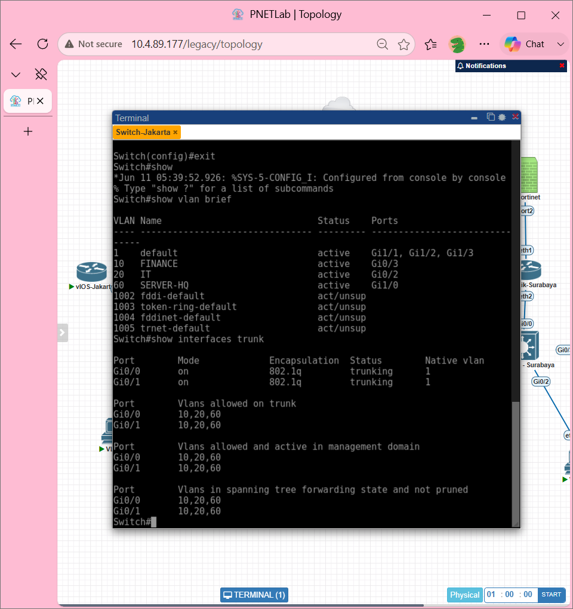

---

## Tugas 2 — Konfigurasi Sub-Interface & VRRP pada vIOS-Jakarta

### Tujuan
Mengatur router vIOS-Jakarta agar mampu menjadi gateway untuk setiap VLAN melalui sub-interface, serta mengaktifkan VRRP sebagai mekanisme *failover* gateway otomatis.

### Langkah-Langkah
1. Masuk ke terminal vIOS-Jakarta.
2. Konfigurasi interface fisik `Gi0/0` dengan IP `10.10.100.2` (penghubung ke FortiGate Jakarta).
3. Buat sub-interface untuk masing-masing VLAN:
   - `Gi0/1.10` → IP `192.168.10.2`, enkapsulasi dot1Q 10, VRRP group 10 IP `192.168.10.1`, priority 110
   - `Gi0/1.20` → IP `192.168.20.2`, enkapsulasi dot1Q 20, VRRP group 20 IP `192.168.20.1`, priority 90
   - `Gi0/1.60` → IP `192.168.60.2`, enkapsulasi dot1Q 60, VRRP group 60 IP `192.168.60.1`, priority 110
4. Tambahkan `ip helper-address 192.168.60.10` pada sub-interface VLAN 10 dan 20 agar permintaan DHCP dari client diteruskan ke server Ubuntu.
5. Simpan konfigurasi dengan `write memory`.
6. Verifikasi dengan `show ip interface brief` dan `show vrrp brief`.

### Hasil
Perintah `show ip interface brief` menunjukkan semua sub-interface sudah mendapatkan IP dan berstatus **up/up**. Perintah `show vrrp brief` mengonfirmasi bahwa vIOS-Jakarta menjadi **Master** untuk VRRP group 10 dan 60 (priority lebih tinggi), sedangkan untuk group 20 menjadi **Master** karena Mikrotik-Jakarta memiliki priority lebih rendah.

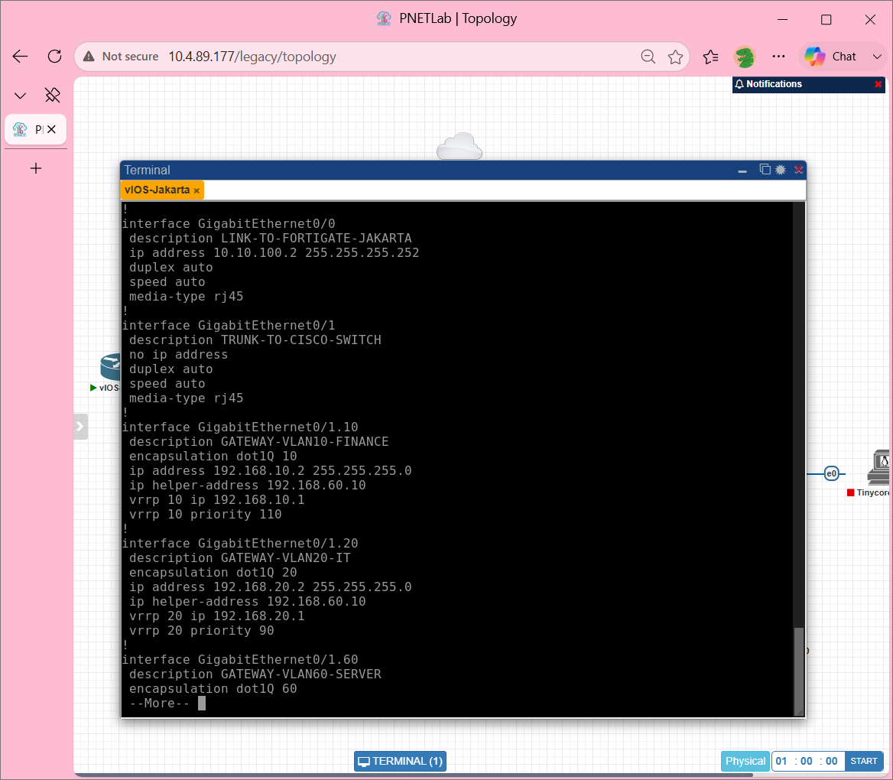

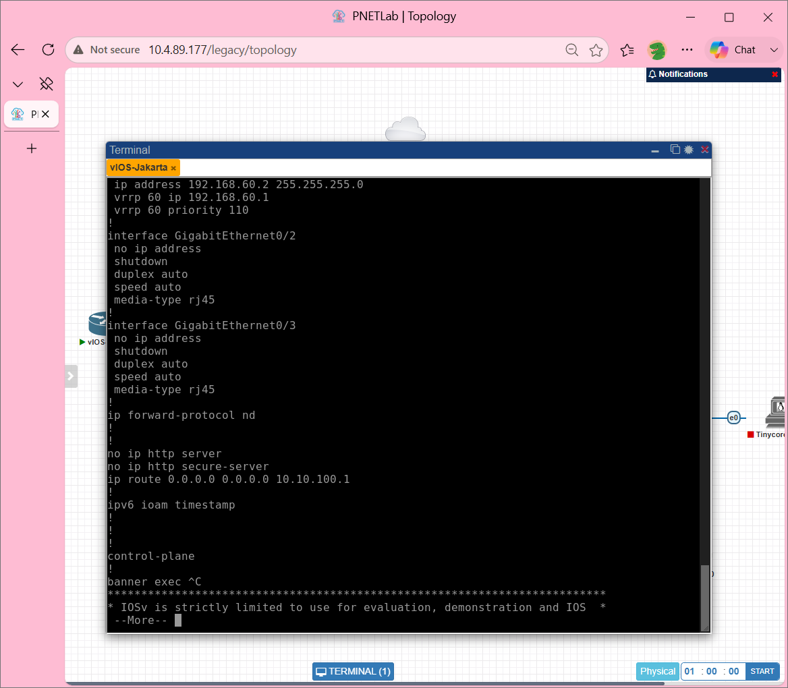

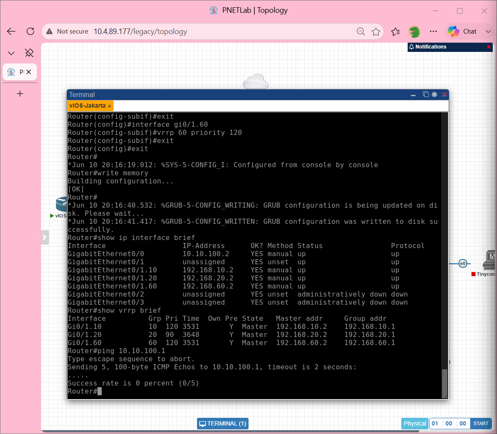

Pengujian ping dari vIOS-Jakarta ke `10.10.100.1` (FortiGate Jakarta) berhasil dengan success rate 100%.

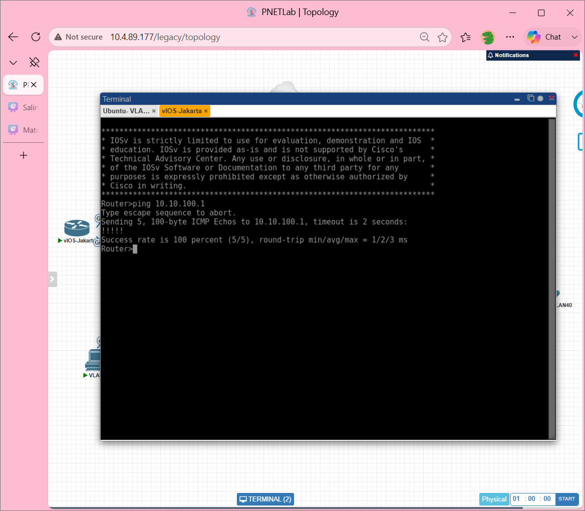

---

## Tugas 3 — Konfigurasi Mikrotik-Jakarta sebagai Backup Gateway (VRRP)

### Tujuan
Mengatur Mikrotik-Jakarta sebagai router cadangan (backup) menggunakan VRRP, sehingga jika vIOS-Jakarta mati, gateway client otomatis berpindah ke Mikrotik-Jakarta.

### Langkah-Langkah
1. Masuk ke terminal Mikrotik-Jakarta.
2. Buat VLAN interface di atas `ether2`:
   - `vlan10-finance` → IP `192.168.10.3/24`
   - `vlan20-it` → IP `192.168.20.3/24`
   - `vlan60-server` → IP `192.168.60.3/24`
3. Konfigurasi VRRP pada setiap VLAN dengan VRI dan priority yang sesuai:
   - `vrrp10` → VRI 10, Priority 90 (lebih rendah dari vIOS)
   - `vrrp20` → VRI 20, Priority 120 (lebih tinggi, jadi Master untuk VLAN 20)
   - `vrrp60` → VRI 60, Priority 90
4. Tambahkan DHCP relay untuk VLAN 10 dan VLAN 20 yang mengarah ke DHCP server `192.168.60.10`.
5. Tambahkan static route default `0.0.0.0/0` via `10.10.101.1` (FortiGate Jakarta port2).
6. Verifikasi dengan `/ip address print`, `/interface vrrp print`, `/ip route print`, dan `/ip dhcp-relay print`.

### Hasil
Mikrotik-Jakarta berhasil terkonfigurasi dengan lengkap. Terbukti dari output `/ip address print` yang menampilkan IP untuk semua VLAN, `/interface vrrp print` menunjukkan status **RM (Running Master)** untuk vrrp20, serta DHCP relay aktif untuk VLAN 10 dan VLAN 20.

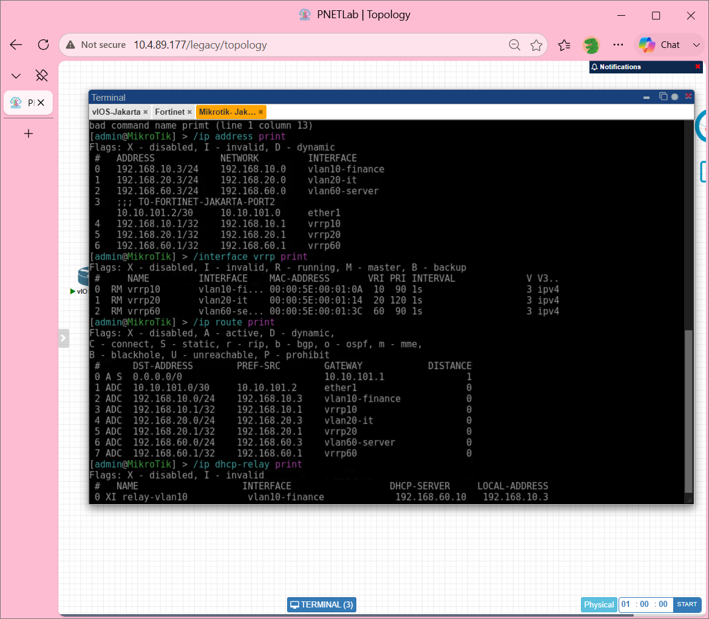

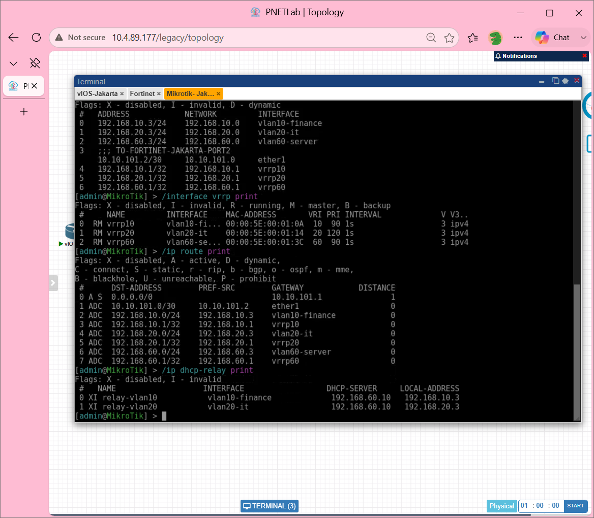

Pengujian ping dari Mikrotik-Jakarta ke FortiGate sisi Jakarta (`10.10.101.1`) berhasil dengan 0% packet loss.

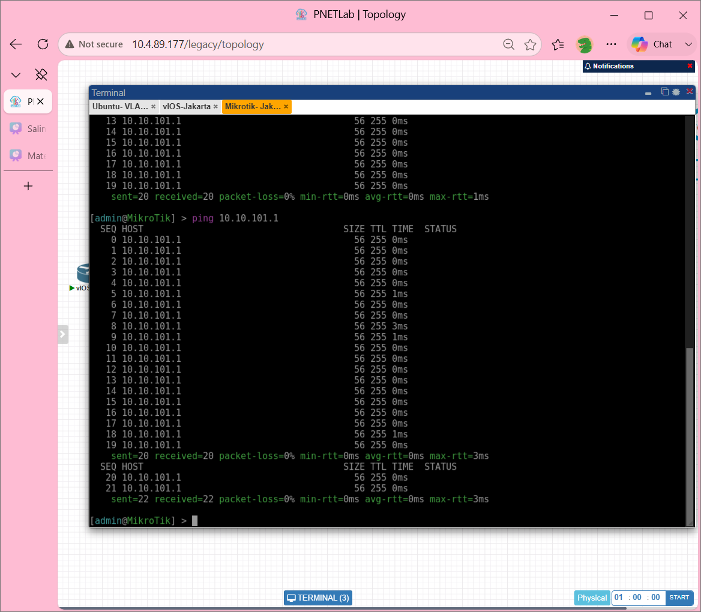

---

## Tugas 4 — Konfigurasi DHCP Server pada Ubuntu-VLAN60

### Tujuan
Mengatur Ubuntu Server yang berada di VLAN 60 sebagai server DHCP yang mendistribusikan IP secara otomatis kepada client di VLAN 10 dan VLAN 20 sisi Jakarta.

### Langkah-Langkah
1. Masuk ke terminal Ubuntu-VLAN60.
2. Install paket DHCP server: `apt install isc-dhcp-server`.
3. Edit file `/etc/default/isc-dhcp-server` untuk menentukan interface yang digunakan, yaitu `eth0`.
4. Edit file konfigurasi utama `/etc/dhcp/dhcpd.conf` dan tambahkan:
   - Pool untuk **VLAN 10** (Finance): range `192.168.10.100–200`, gateway `192.168.10.1`, DNS `8.8.8.8, 1.1.1.1`
   - Pool untuk **VLAN 20** (IT): range `192.168.20.100–200`, gateway `192.168.20.1`
   - Deklarasi subnet untuk **VLAN 60** tanpa range (server sendiri)
5. Restart dan aktifkan service DHCP: `systemctl restart isc-dhcp-server` dan `systemctl enable isc-dhcp-server`.
6. Cek status service untuk memastikan berjalan.

### Hasil
Service DHCP berhasil berjalan dengan status **active (running)**. Log menunjukkan server mulai mendengarkan permintaan DHCP di interface `eth0` pada subnet `192.168.60.0/24`.

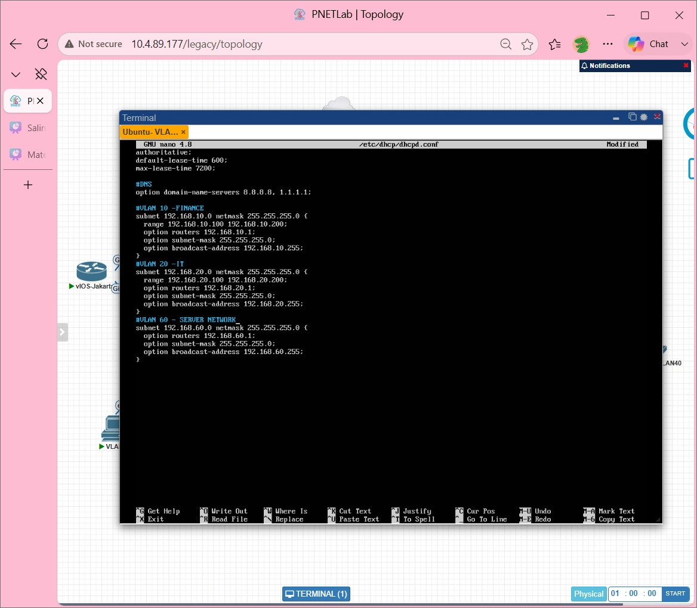

Ubuntu server sendiri memiliki IP `192.168.60.10/24` dan dapat terhubung ke internet (`ping 8.8.8.8` berhasil).

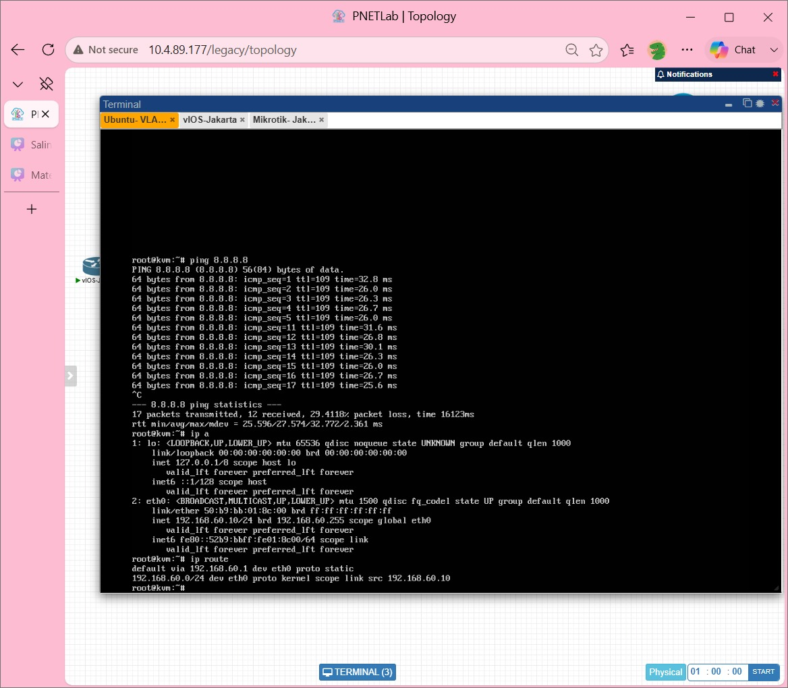

---

## Tugas 5 — Konfigurasi FortiGate Jakarta

### Tujuan
Mengatur FortiGate Jakarta sebagai firewall sekaligus gateway keluar (NAT) untuk jaringan sisi Jakarta agar client bisa mengakses internet, serta meneruskan lalu lintas antar-sisi.

### Langkah-Langkah
1. Masuk ke terminal FortiGate-Jakarta.
2. Konfigurasi interface:
   - `port1` → IP `10.10.100.1/30` (penghubung ke vIOS-Jakarta)
   - `port2` → IP `10.10.101.1/30` (penghubung ke Mikrotik-Jakarta)
   - `port3` → IP `10.0.12.2/30` (penghubung ke Mikrotik-ISP)
3. Tambahkan static route default menuju ISP (`0.0.0.0/0` via `10.0.12.1`) dan static route ke jaringan VLAN sisi Jakarta melalui vIOS (`192.168.10.0/24`, `192.168.20.0/24`, `192.168.60.0/24` via `10.10.100.2`).
4. Buat firewall policy **LAN-TO-INTERNET**: izinkan traffic dari `port1` dan `port2` keluar melalui `port3` dengan NAT aktif.

### Hasil
Perintah `get system interface physical` mengonfirmasi semua interface sudah mendapat IP dan berstatus **up**. Tabel routing FortiGate menampilkan route statis ke tiga subnet VLAN Jakarta dan default route ke ISP.

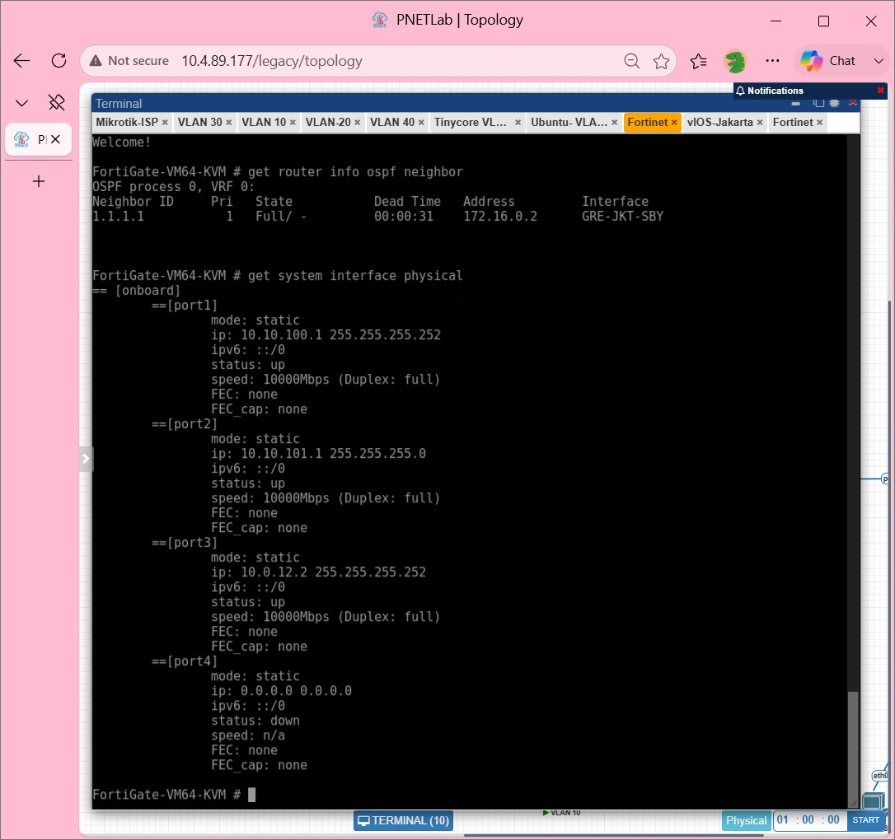

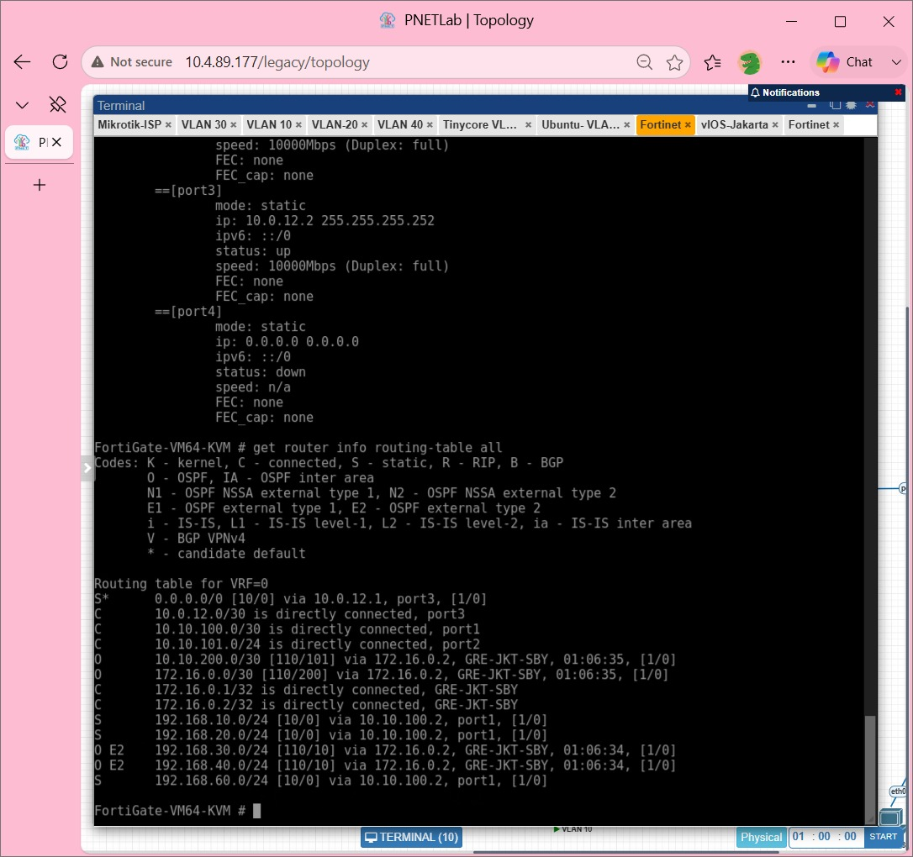

Firewall policy **LAN-TO-INTERNET** berhasil terbuat dengan NAT diaktifkan, memungkinkan seluruh client di belakang FortiGate mengakses internet.

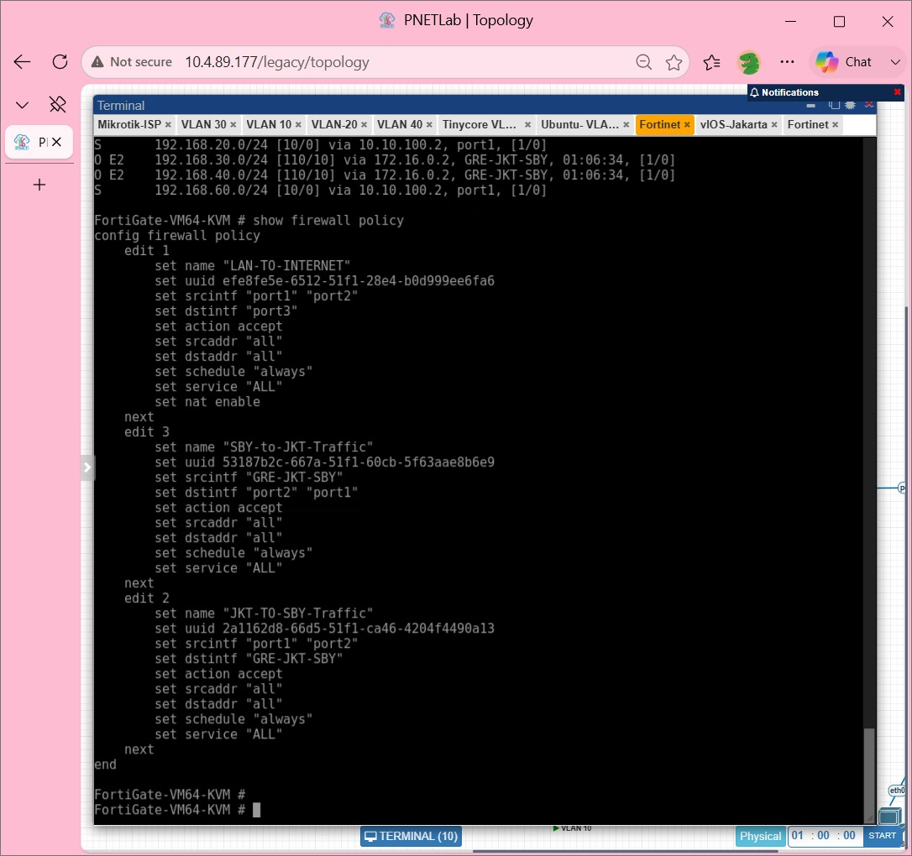

Pengujian ping dari FortiGate ke internet (`8.8.8.8`), ke vIOS-Jakarta (`10.10.100.2`), dan ke Mikrotik-ISP (`10.0.12.1`) semuanya berhasil 100%.

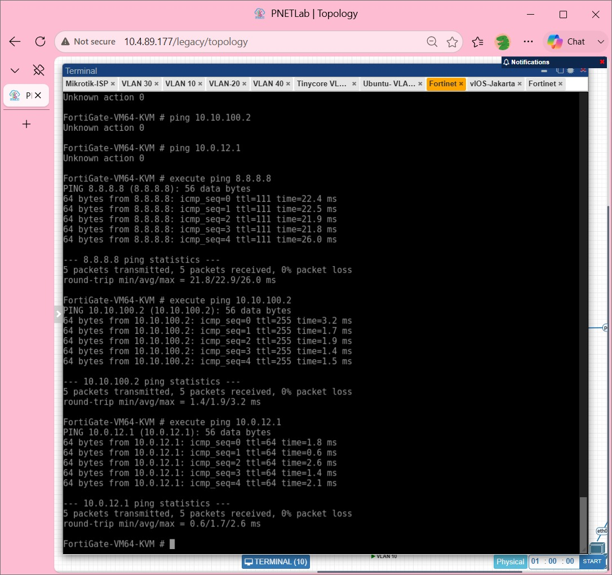

Get Router OSPF info neighboor & get router info routing-table ospf

---

## Tugas 6 — Konfigurasi Mikrotik-ISP

### Tujuan
Mengatur Mikrotik-ISP sebagai router inti yang menghubungkan sisi Jakarta dan sisi Surabaya, sekaligus sebagai gateway yang terhubung ke jaringan luar (internet simulasi).

### Langkah-Langkah
1. Masuk ke terminal Mikrotik-ISP.
2. Konfigurasi IP pada masing-masing interface:
   - `ether1` → menggunakan DHCP client (mendapat IP dari lab, contoh: `10.0.137.199/24`)
   - `ether2` → IP `10.0.12.1/30` (penghubung ke FortiGate Jakarta)
   - `ether3` → IP `10.0.13.1/30` (penghubung ke FortiGate Surabaya)
3. Aktifkan DHCP client di `ether1` agar Mikrotik-ISP mendapat koneksi internet.
4. Tambahkan firewall NAT masquerade di `ether1` agar seluruh traffic dari sisi Jakarta dan Surabaya bisa keluar ke internet melalui IP publik ISP.

### Hasil
Output `/ip address print` memperlihatkan semua IP sudah terpasang dengan benar. `/ip route print` menunjukkan default route aktif via `10.0.137.1`. `/ip firewall nat print` mengonfirmasi aturan masquerade sudah aktif di `ether1`.

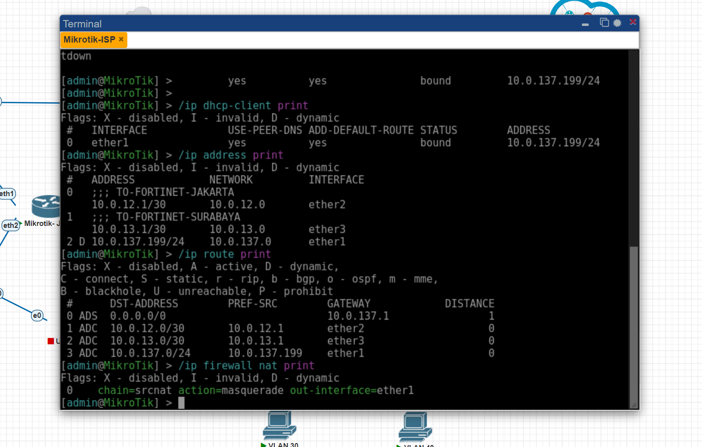

Pengujian ping dari Mikrotik-ISP ke internet (`8.8.8.8`) berhasil dengan 0% packet loss, membuktikan koneksi ISP berfungsi normal.

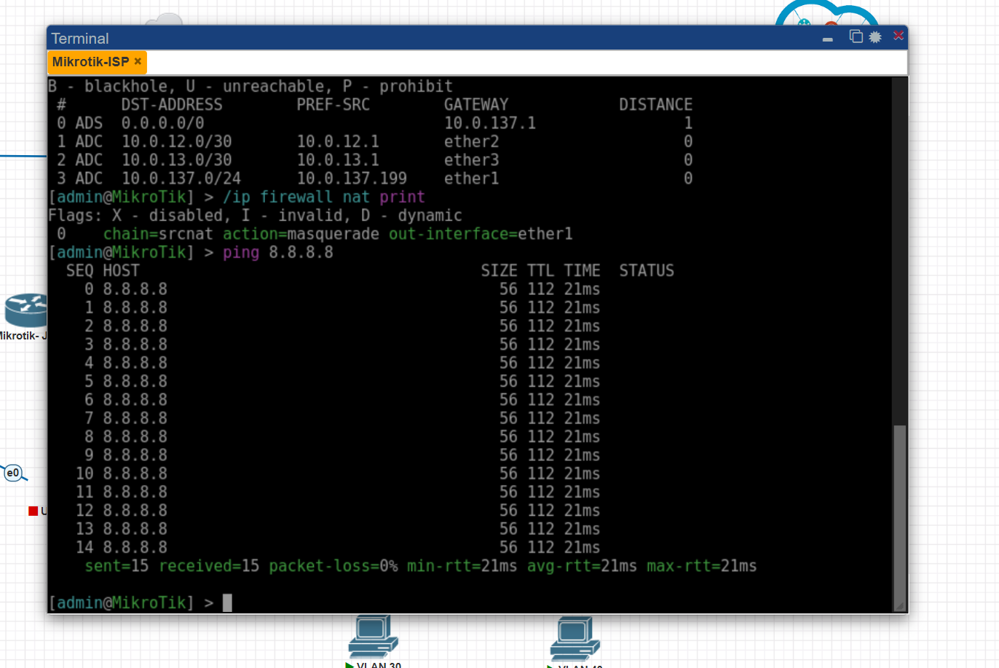

Ping ke FortiGate Jakarta (`10.0.12.2`) juga berhasil sempurna, menandakan koneksi antar ISP dan sisi Jakarta terhubung dengan baik.

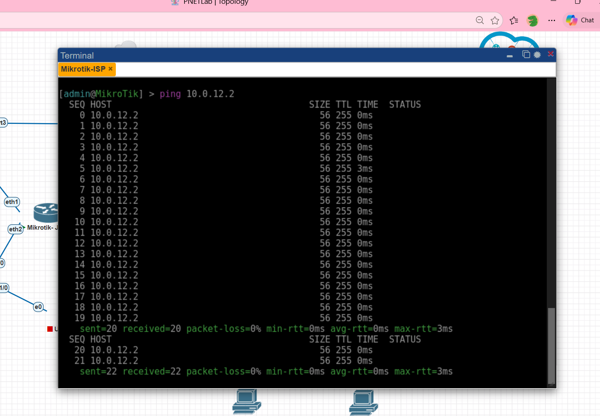

---

## Tugas 7 — Konfigurasi GRE Tunnel & Firewall Policy FortiGate (Jakarta–Surabaya)

### Tujuan
Membuat terowongan (tunnel) GRE antara FortiGate Jakarta dan FortiGate Surabaya agar dua sisi jaringan dapat berkomunikasi secara langsung melalui ISP, serta menambahkan firewall policy yang mengizinkan lalu lintas melewati tunnel tersebut.

### Langkah-Langkah
1. Pada FortiGate Jakarta, buat GRE tunnel interface bernama `GRE-JKT-SBY`:
   - Source IP: port3 FortiGate Jakarta (`10.0.12.2`)
   - Destination IP: port3 FortiGate Surabaya (`10.0.13.2`)
   - Assign IP tunnel: `172.16.0.1/30`
2. Tambahkan static route di FortiGate Jakarta agar jaringan sisi Surabaya (`192.168.30.0/24`, `192.168.40.0/24`) dapat dicapai melalui tunnel GRE.
3. Buat firewall policy untuk mengizinkan traffic antar-sisi:
   - Policy **LAN-TO-INTERNET**: dari `port1, port2` ke `port3` dengan NAT
   - Policy **SBY-to-JKT-Traffic**: dari interface `GRE-JKT-SBY` ke `port2, port1`
   - Policy **JKT-TO-SBY-Traffic**: dari `port1, port2` ke interface `GRE-JKT-SBY`
4. Lakukan hal yang sama (mirror) di FortiGate Surabaya.

### Hasil
Switch Surabaya berhasil dikonfigurasi. Output `show vlan brief` menampilkan VLAN `30` (nama **SALES**, port `Gi0/1`) dan VLAN `40` (nama **OPERATIONS**, port `Gi0/2`, `Gi0/3`) dalam status **active**. Output `show interfaces trunk` mengkonfirmasi port `Gi0/0` berjalan sebagai trunk mode `on` dengan enkapsulasi `802.1q`, membawa VLAN `30,40`.
 
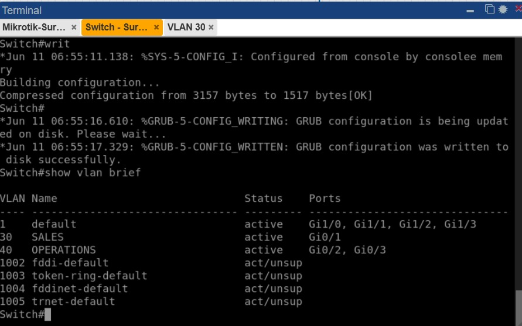
 
MikroTik Surabaya berhasil dikonfigurasi dengan tiga IP address: `10.10.200.2/30` pada `ether1` (link ke FortiGate Surabaya), `192.168.30.1/24` pada `vlan30-sales`, dan `192.168.40.1/24` pada `vlan40-operations`. DHCP Server aktif pada interface `vlan30-sales` menggunakan `pool-vlan30` dengan lease time `10m`.
 
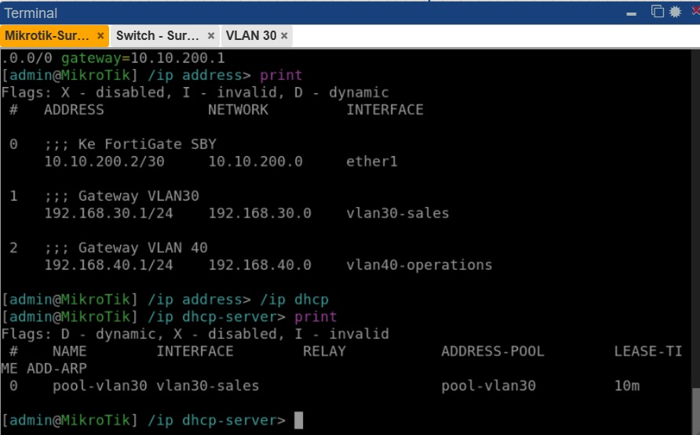
 
IP Pool untuk VLAN 30 dikonfigurasi dengan range `192.168.30.100–192.168.30.200`. Tabel routing MikroTik Surabaya menampilkan default route (`0.0.0.0/0`) via gateway `10.10.200.1` (FortiGate Surabaya), serta tiga connected route untuk jaringan `10.10.200.0/30`, `192.168.30.0/24`, dan `192.168.40.0/24`.
 
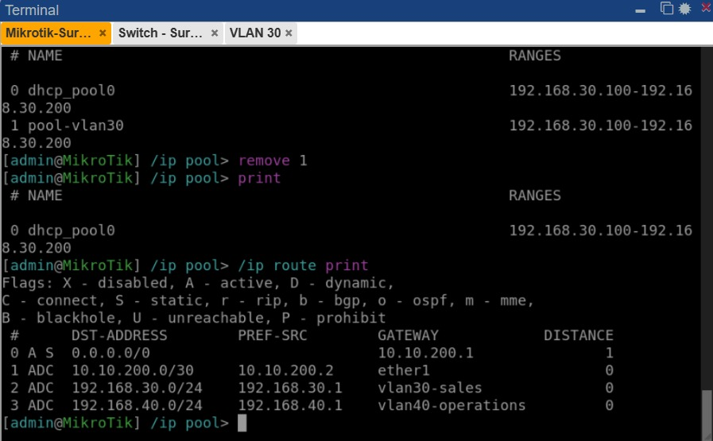
 
Client VLAN 30 berhasil mendapatkan IP secara DHCP dari MikroTik Surabaya. Output `show ip` mengkonfirmasi IP `192.168.30.200/24`, gateway `192.168.30.1`, dan DNS `8.8.8.8` dengan DHCP Server `192.168.30.1`.
 
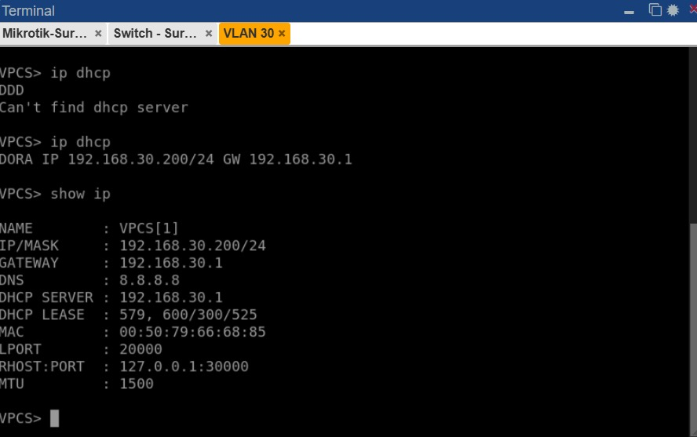
 
Pengujian ping dari client Surabaya ke `8.8.8.8` (internet) berhasil dengan 0% packet loss, membuktikan konektivitas internet dari sisi Surabaya berjalan melalui MikroTik Surabaya dan FortiGate Surabaya.
 
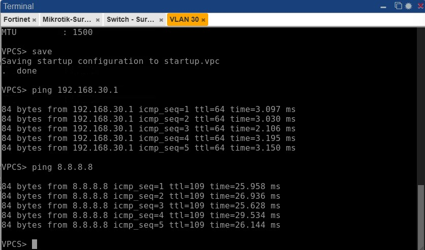
---

## Tugas 8 — Konfigurasi OSPF over GRE

### Tujuan
Menjalankan protokol routing OSPF di atas tunnel GRE agar rute-rute jaringan dari sisi Jakarta dan Surabaya bisa saling dikenal dan disebarkan secara otomatis, tanpa perlu mengisi static route satu per satu.

### Langkah-Langkah
1. Pada FortiGate Jakarta, aktifkan OSPF:
   - Tentukan Router ID (misal `1.1.1.1`)
   - Masukkan semua network yang terhubung ke dalam area OSPF 0 (backbone), termasuk network GRE tunnel dan network VLAN lokal.
2. Lakukan konfigurasi OSPF yang sama di FortiGate Surabaya dengan Router ID berbeda (misal `2.2.2.2`).
3. Tunggu beberapa saat agar kedua FortiGate membentuk hubungan tetangga OSPF (*neighbor*) melalui tunnel GRE.
4. Verifikasi OSPF neighbor dengan perintah `get router info ospf neighbor`.
5. Verifikasi tabel routing OSPF dengan `get router info routing-table ospf`.

### Hasil

FortiGate Surabaya berhasil dikonfigurasi. Output `get system interface physical` menampilkan `port1` (IP `10.0.13.2`, status **up**) dan `port2` (IP `10.10.200.1`, status **up**).

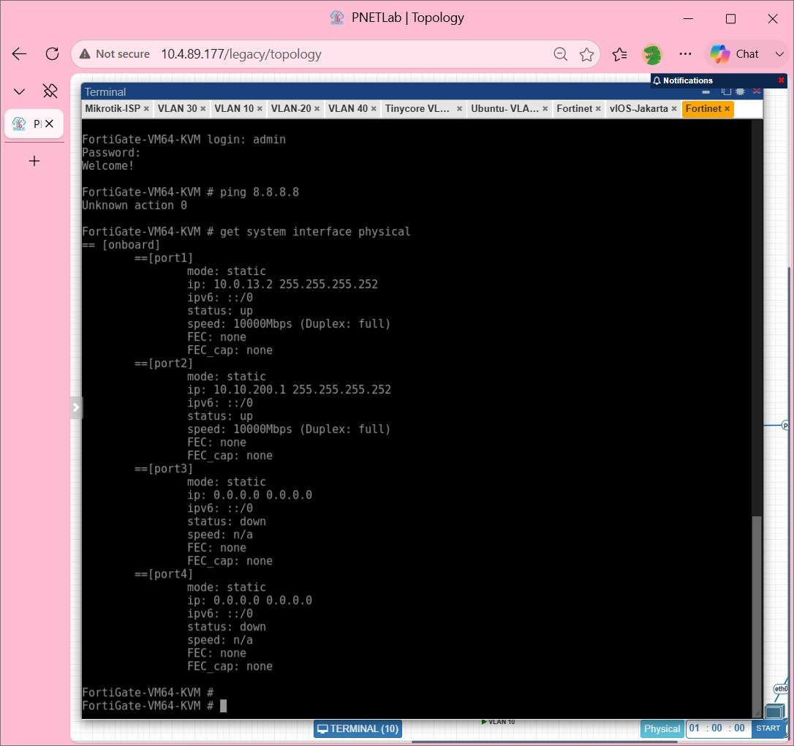

Tabel routing lengkap FortiGate Surabaya menampilkan rute default ke ISP (`0.0.0.0/0`), rute OSPF ke jaringan Jakarta (`192.168.10.0/24`, `192.168.20.0/24`) melalui tunnel `GRE-SBY-JKT`, serta static route ke jaringan lokal Surabaya. Firewall policy juga dikonfirmasi aktif dengan tiga aturan: **Internet-Access**, **SBY-to-JKT**, dan **JKY-to-SBY**.

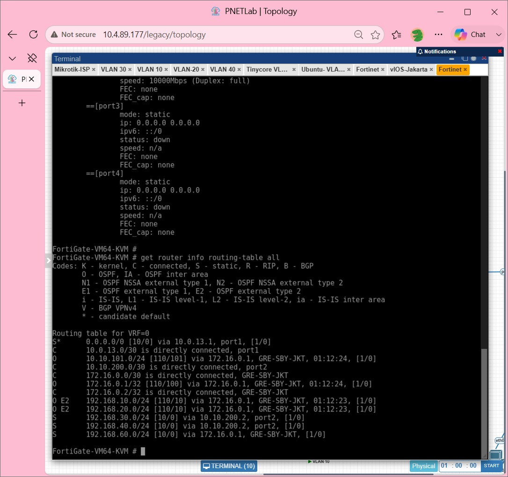

Pengujian ping dari FortiGate Surabaya ke `8.8.8.8` (internet) dan ke `172.16.0.1` (ujung tunnel GRE sisi Jakarta) berhasil 0% packet loss. Perintah `get router info ospf neighbor` mengonfirmasi neighbor **FULL** dengan Neighbor ID `1.1.1.1` melalui interface `GRE-JKT-SBY`. Tabel routing OSPF Surabaya menampilkan rute ke jaringan Jakarta yang dipelajari secara otomatis.

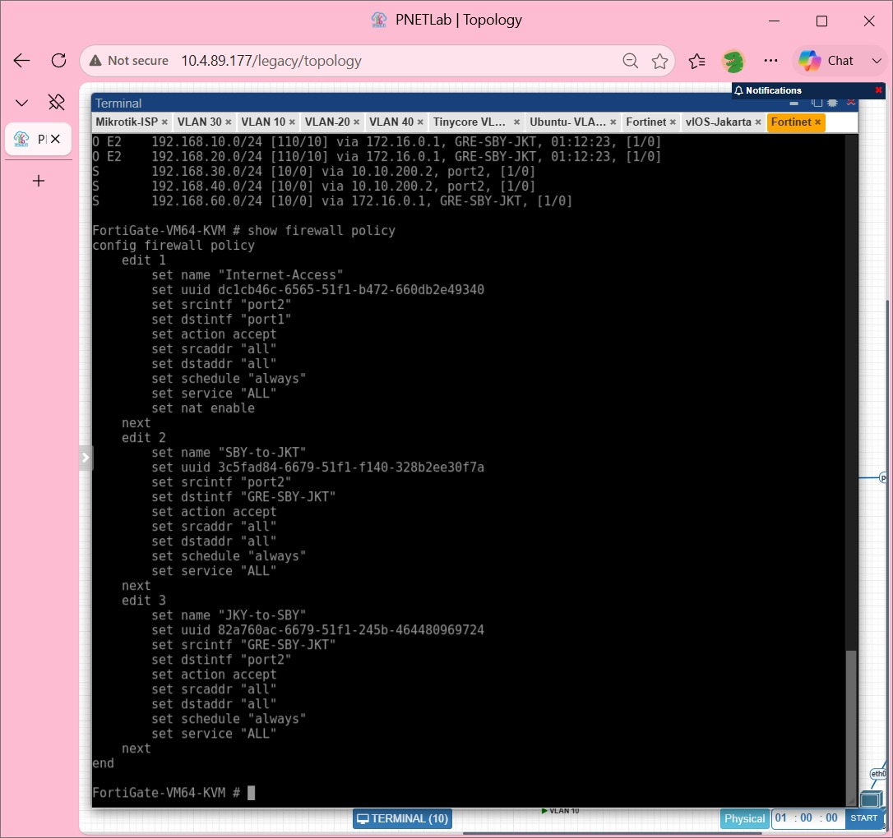

Dari sisi FortiGate Jakarta, ping ke `8.8.8.8` dan ke `172.16.0.1` (ujung tunnel GRE sisi Surabaya) juga berhasil. Perintah `get router info ospf neighbor` mengonfirmasi neighbor **FULL** dengan Neighbor ID `2.2.2.2` melalui interface `GRE-SBY-JKT`. Tabel routing OSPF Jakarta menampilkan rute ke jaringan Surabaya (`192.168.10.0/24`, `192.168.20.0/24`) yang sudah terdistribusi otomatis.

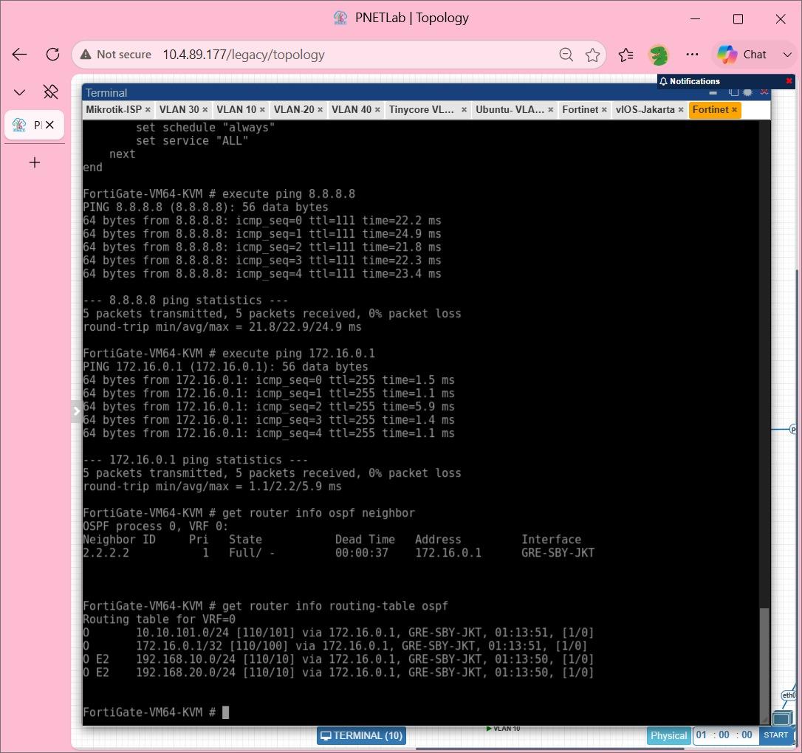

---

## Tugas 9 — Pengujian Konektivitas Antar-Sisi & Akses Internet

### Tujuan
Membuktikan bahwa seluruh client di sisi Jakarta maupun Surabaya dapat memperoleh IP (DHCP/statis), mengakses internet, dan saling berkomunikasi antar-sisi melalui tunnel GRE dan OSPF.

### Langkah-Langkah
1. Pastikan web server sudah berjalan di Ubuntu-VLAN60 (IP `192.168.60.10`).
2. Verifikasi client VLAN 10 dan VLAN 30 mendapat IP dari DHCP.
3. Uji ping ke internet (`8.8.8.8`) dari setiap VLAN.
4. Uji ping antar-sisi: VLAN 20 Jakarta → VLAN 40 Surabaya, dan VLAN 30 Surabaya → internet.

### Hasil

VLAN 10 (Finance, Jakarta) berhasil mendapatkan IP `192.168.10.100/24` dengan gateway `192.168.10.1` melalui DHCP dari Ubuntu Server.

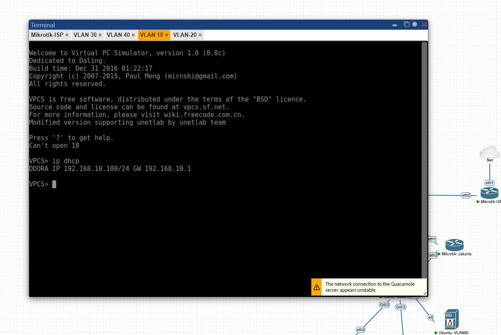

VLAN 30 (Surabaya) berhasil mendapatkan IP `192.168.30.200/24` dengan gateway `192.168.30.1` melalui DHCP dari Mikrotik-Surabaya.

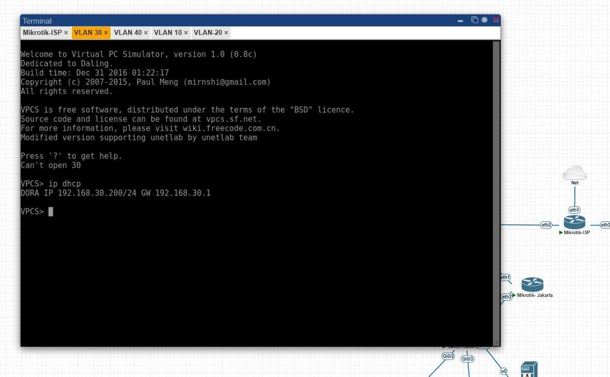

VLAN 30 Surabaya berhasil ping ke `8.8.8.8` dengan 0% packet loss, membuktikan koneksi internet dari sisi Surabaya berjalan normal.

VLAN 20 (IT, Jakarta) berhasil mendapat IP `192.168.20.100/24` dan melakukan ping ke internet (`8.8.8.8`). Pengujian ping ke `192.168.40.10` (VLAN 40 Surabaya) berhasil dengan 0% packet loss, membuktikan konektivitas Jakarta ke Surabaya melalui tunnel GRE berjalan sempurna.

---

## Tugas 10 — Pengujian Failover VRRP

### Tujuan
Membuktikan bahwa mekanisme VRRP berjalan dengan benar: ketika gateway utama (vIOS-Jakarta) dimatikan, client di VLAN 10 dan VLAN 20 tidak mengalami pemutusan koneksi yang lama karena gateway otomatis berpindah ke Mikrotik-Jakarta.

### Langkah-Langkah
1. Pastikan client VLAN 10 dan VLAN 20 sudah mendapatkan IP dari DHCP dan bisa ping ke luar.
2. Lakukan ping terus-menerus (continuous ping) dari client ke gateway VRRP (`192.168.10.1` atau `192.168.20.1`).
3. Matikan perangkat vIOS-Jakarta (shutdown dari PNETLab).
4. Amati apakah ping berhenti total atau hanya putus sebentar lalu lanjut kembali.
5. Jika VRRP berjalan benar, Mikrotik-Jakarta akan otomatis mengambil alih peran sebagai Master gateway dalam waktu singkat (sesuai interval VRRP yang dikonfigurasi).

### Hasil

Sebelum failover, VLAN 30 berhasil mendapat IP DHCP dan ping ke `8.8.8.8` berjalan normal, menandakan kondisi jaringan stabil sebelum vIOS-Jakarta dimatikan.

Saat vIOS-Jakarta dimatikan, VLAN 20 menunjukkan adanya timeout sesaat pada ping ke `8.8.8.8`, namun koneksi kembali pulih secara otomatis. Topologi PNETLab memperlihatkan kondisi jaringan sisi Surabaya tetap aktif selama proses failover berlangsung.

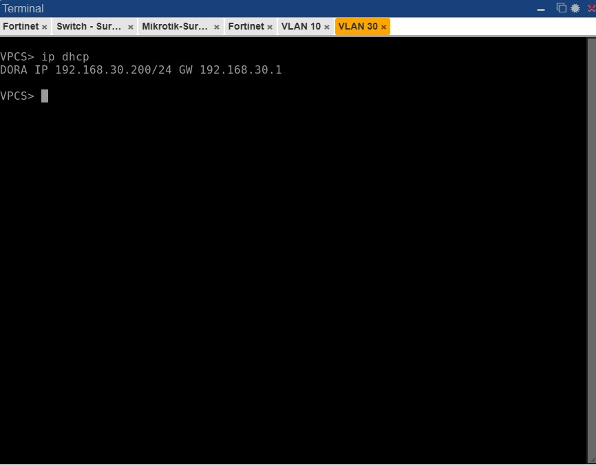

VLAN 30 Surabaya tetap dapat ping ke `8.8.8.8` selama proses failover, membuktikan sisi Surabaya tidak terpengaruh.

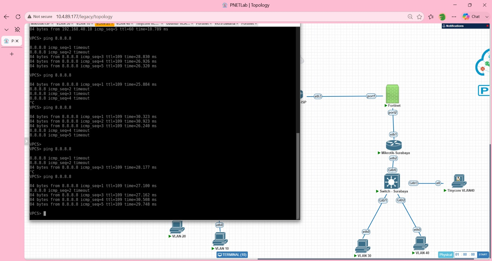

VLAN 20 Jakarta berhasil ping ke `192.168.40.10` (VLAN 40 Surabaya) setelah failover selesai, membuktikan konektivitas antar-sisi tetap terjaga meskipun gateway utama telah berpindah ke Mikrotik-Jakarta.

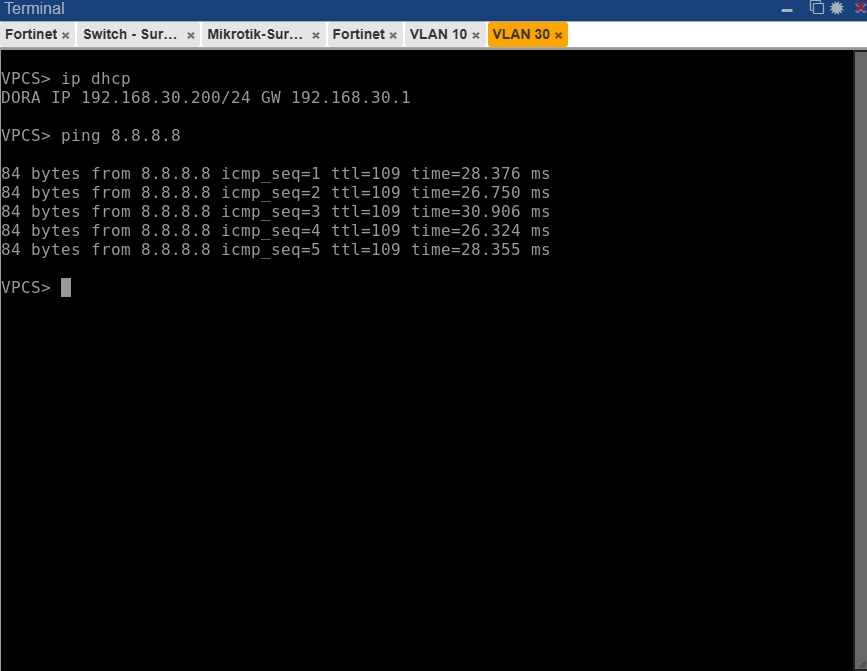

VLAN 10 Jakarta berhasil mendapatkan IP `192.168.10.100/24` dari DHCP melalui gateway VRRP baru (Mikrotik-Jakarta), membuktikan proses failover VRRP selesai dengan sempurna dan client tidak perlu konfigurasi ulang.

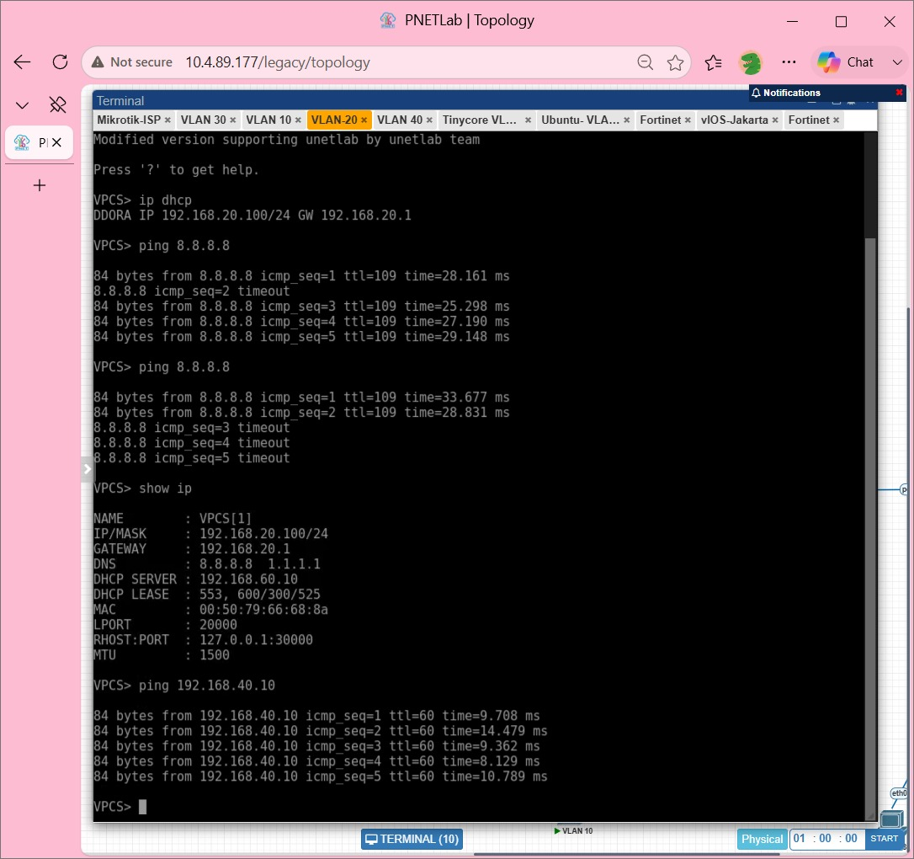

Client yang berasal dari Surabaya dapat mengakses web server yang berada di Jakarta.

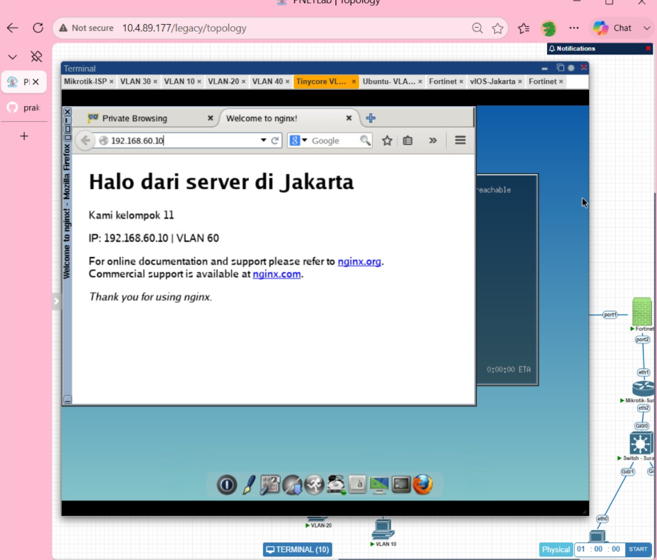
---

## Ringkasan Hasil Pengujian

| No | Yang Diuji | Hasil |
|:---:|---|:---:|
| 1 | VLAN 10 Jakarta mendapat IP DHCP dari Ubuntu Server | Berhasil |
| 2 | VLAN 20 Jakarta mendapat IP DHCP dari Ubuntu Server | Berhasil |
| 3 | VLAN 30 Surabaya mendapat IP DHCP dari MikroTik Surabaya | Berhasil |
| 4 | VLAN 40 Surabaya menggunakan IP statis | Berhasil |
| 5 | Client Jakarta dapat ping ke 8.8.8.8 (internet) | Berhasil |
| 6 | Client Surabaya dapat ping ke 8.8.8.8 (internet) | Berhasil |
| 7 | Client Jakarta dapat ping ke client Surabaya | Berhasil |
| 8 | Client Surabaya dapat ping ke client Jakarta | Berhasil |
| 9 | Client Surabaya dapat mengakses web server Jakarta | Berhasil |
| 10 | Failover gateway VRRP berjalan saat vIOS dimatikan | Berhasil |
