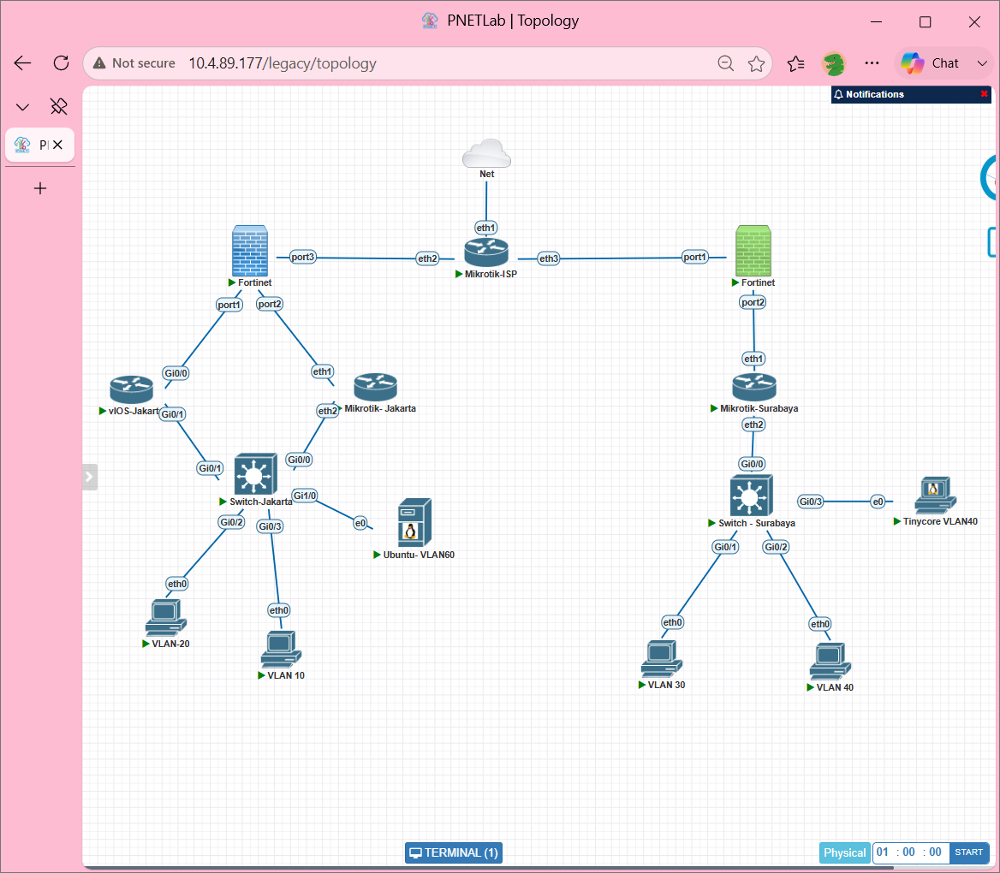
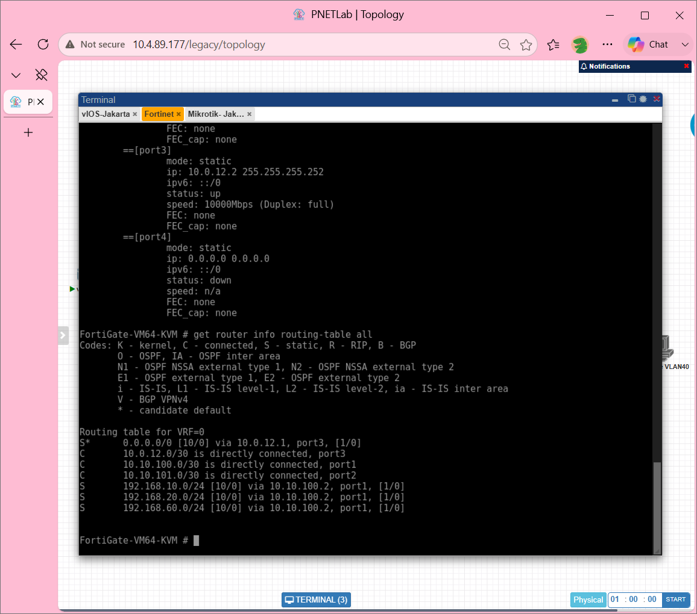

# Laporan Tugas Modul — Jaringan Komputer Lanjut
## Konfigurasi VLAN, VRRP, DHCP, Routing, dan GRE Tunnel

---

## Topologi Jaringan

Topologi yang digunakan dalam tugas modul ini terdiri dari dua sisi jaringan, yaitu sisi Jakarta dan sisi Surabaya, yang saling terhubung melalui Mikrotik-ISP sebagai perantara. Setiap sisi memiliki perangkat firewall FortiGate, router (vIOS atau Mikrotik), switch Cisco, dan beberapa klien yang terbagi dalam beberapa VLAN.

Perangkat yang digunakan:

| Perangkat | Fungsi |
|---|---|
| Mikrotik-ISP | Router ISP penghubung Jakarta dan Surabaya |
| FortiGate (Jakarta & Surabaya) | Firewall sekaligus gateway ke ISP |
| vIOS-Jakarta | Router Layer 3 sisi Jakarta (VRRP Master) |
| Mikrotik-Jakarta | Router Layer 3 sisi Jakarta (VRRP Backup) |
| Switch-Jakarta | Switch Layer 2 pengelola VLAN |
| Ubuntu VLAN60 | Server DHCP untuk semua VLAN di Jakarta |
| VLAN 10 (Finance), VLAN 20 (IT) | Klien di sisi Jakarta |
| VLAN 30, VLAN 40, VLAN 60 | Klien dan server di sisi Surabaya |

---

## Tugas 1 — Konfigurasi VLAN pada Switch-Jakarta

### Tujuan
Membuat pemisahan jaringan menggunakan VLAN pada Switch-Jakarta (Cisco) agar setiap divisi/kelompok perangkat berada dalam segmen jaringan yang terpisah. VLAN yang dibuat adalah VLAN 10 (FINANCE), VLAN 20 (IT), dan VLAN 60 (SERVER-HQ).

### Langkah-Langkah
1. Masuk ke konfigurasi switch melalui terminal PNETLab.
2. Buat VLAN 10 dengan nama FINANCE, VLAN 20 dengan nama IT, dan VLAN 60 dengan nama SERVER-HQ.
3. Atur port `Gi0/3` sebagai **access port** untuk VLAN 10, port `Gi0/2` sebagai access port untuk VLAN 20, dan port `Gi1/0` sebagai access port untuk VLAN 60.
4. Atur port `Gi0/0` dan `Gi0/1` sebagai **trunk port** menggunakan enkapsulasi 802.1q agar dapat membawa semua VLAN sekaligus ke arah router.
5. Simpan konfigurasi, lalu verifikasi menggunakan perintah `show vlan brief` dan `show interfaces trunk`.

### Hasil
Perintah `show vlan brief` memperlihatkan ketiga VLAN sudah terdaftar dan aktif: VLAN 10 (FINANCE) terhubung ke Gi0/3, VLAN 20 (IT) ke Gi0/2, dan VLAN 60 (SERVER-HQ) ke Gi1/0. Perintah `show interfaces trunk` memperlihatkan port Gi0/0 dan Gi0/1 sudah berjalan dalam mode trunking dengan VLAN yang diizinkan adalah 10, 20, dan 60.

---

## Tugas 2 — Konfigurasi VRRP dan Subinterface pada vIOS-Jakarta

### Tujuan
Mengonfigurasi vIOS-Jakarta sebagai router utama (master) untuk setiap VLAN menggunakan protokol VRRP (Virtual Router Redundancy Protocol). Dengan VRRP, jika router utama mati, router cadangan (Mikrotik-Jakarta) akan otomatis mengambil alih sehingga koneksi klien tidak terputus.

### Langkah-Langkah
1. Masuk ke terminal vIOS-Jakarta.
2. Buat **subinterface** pada antarmuka `GigabitEthernet0/1` untuk masing-masing VLAN:
   - `Gi0/1.10` → enkapsulasi dot1Q 10, IP `192.168.10.2/24`, VRRP grup 10 dengan IP virtual `192.168.10.1` dan prioritas 110 (Master).
   - `Gi0/1.20` → enkapsulasi dot1Q 20, IP `192.168.20.2/24`, VRRP grup 20 dengan IP virtual `192.168.20.1` dan prioritas 90 (Backup untuk VLAN 20).
   - `Gi0/1.60` → enkapsulasi dot1Q 60, IP `192.168.60.2/24`, VRRP grup 60 dengan IP virtual `192.168.60.1` dan prioritas 120 (Master).
3. Atur `GigabitEthernet0/0` dengan IP `10.10.100.2/30` sebagai penghubung ke FortiGate.
4. Tambahkan default route ke `10.10.100.1` (FortiGate).
5. Tambahkan `ip helper-address 192.168.60.10` pada subinterface VLAN 10 dan 20 agar permintaan DHCP dari klien diteruskan ke server DHCP di VLAN 60.
6. Simpan konfigurasi dengan `write memory`.

### Hasil
Perintah `show ip interface brief` menampilkan semua subinterface sudah aktif dengan alamat IP yang benar. Perintah `show vrrp brief` memperlihatkan ketiga subinterface menjadi **Master**. Koneksi ke FortiGate (10.10.100.1) berhasil dicapai dari vIOS-Jakarta.

**Konfigurasi subinterface (running-config):**

**Verifikasi VRRP dan ping ke FortiGate:**

**Ping dari vIOS-Jakarta ke FortiGate berhasil (100%):**

---

## Tugas 3 — Konfigurasi Mikrotik-Jakarta (VRRP Backup & DHCP Relay)

### Tujuan
Mengonfigurasi Mikrotik-Jakarta sebagai router cadangan (backup) VRRP. Mikrotik ini juga menjalankan DHCP Relay agar permintaan IP dari klien VLAN 10 dan VLAN 20 bisa diteruskan ke server DHCP Ubuntu di VLAN 60.

### Langkah-Langkah
1. Masuk ke terminal Mikrotik-Jakarta.
2. Buat antarmuka VLAN di atas ether2 (trunk):
   - `vlan10-finance` untuk VLAN 10, IP `192.168.10.3/24`.
   - `vlan20-it` untuk VLAN 20, IP `192.168.20.3/24`.
   - `vlan60-server` untuk VLAN 60, IP `192.168.60.3/24`.
3. Buat antarmuka **VRRP**:
   - `vrrp10` di atas vlan10-finance, VRI 10, prioritas 90, IP virtual `192.168.10.1`.
   - `vrrp20` di atas vlan20-it, VRI 20, prioritas 120 (Master untuk VLAN 20), IP virtual `192.168.20.1`.
   - `vrrp60` di atas vlan60-server, VRI 60, prioritas 90, IP virtual `192.168.60.1`.
4. Tambahkan antarmuka `ether1` dengan IP `10.10.101.2/30` sebagai penghubung ke FortiGate sisi port2.
5. Tambahkan **default route** menuju `10.10.101.1` (FortiGate).
6. Tambahkan **DHCP Relay** pada vlan10-finance dan vlan20-it yang mengarah ke server DHCP `192.168.60.10`.

### Hasil
Perintah `/ip address print` memperlihatkan semua alamat IP sudah terpasang dengan benar, termasuk alamat-alamat VRRP virtual. Perintah `/interface vrrp print` menunjukkan semua antarmuka VRRP berjalan. Perintah `/ip route print` menampilkan routing table lengkap dengan default route dan rute ke semua subnet VLAN. Perintah `/ip dhcp-relay print` memperlihatkan relay aktif untuk VLAN 10 dan VLAN 20 yang mengarah ke `192.168.60.10`. Uji konektivitas dengan `ping 10.10.101.1` berhasil dengan **packet loss 0%**.

---

## Tugas 4 — Konfigurasi DHCP Server pada Ubuntu VLAN60

### Tujuan
Menjadikan Ubuntu di VLAN 60 sebagai server DHCP terpusat yang membagikan alamat IP secara otomatis kepada semua klien di VLAN 10, VLAN 20, dan VLAN 60.

### Langkah-Langkah
1. Masuk ke terminal Ubuntu-VLAN60.
2. Pasang layanan DHCP server: `apt install isc-dhcp-server`.
3. Edit file konfigurasi `/etc/dhcp/dhcpd.conf` menggunakan `nano`, lalu tambahkan:
   - Deklarasi subnet untuk **VLAN 10** (192.168.10.0/24): rentang IP 192.168.10.100–200, gateway 192.168.10.1, DNS 8.8.8.8 dan 1.1.1.1.
   - Deklarasi subnet untuk **VLAN 20** (192.168.20.0/24): rentang IP 192.168.20.100–200, gateway 192.168.20.1.
   - Deklarasi subnet untuk **VLAN 60** (192.168.60.0/24): gateway 192.168.60.1 (tanpa rentang karena server statis).
4. Simpan dan mulai ulang layanan DHCP: `systemctl restart isc-dhcp-server`.
5. Atur IP statis Ubuntu sendiri: `192.168.60.10/24` dengan gateway `192.168.60.1`.
6. Uji konektivitas Ubuntu ke internet dengan `ping 8.8.8.8`.

### Hasil
File konfigurasi `/etc/dhcp/dhcpd.conf` berhasil tersimpan dengan tiga blok deklarasi subnet. Perintah `ip a` memperlihatkan Ubuntu sudah menggunakan IP `192.168.60.10/24` pada antarmuka eth0. Perintah `ip route` menampilkan default route melalui `192.168.60.1`. Ping ke `8.8.8.8` berhasil, membuktikan Ubuntu bisa mengakses internet.

---

## Tugas 5 — Konfigurasi FortiGate Jakarta

### Tujuan
Mengonfigurasi FortiGate Jakarta sebagai firewall dan gateway antara jaringan lokal (LAN) dengan ISP. FortiGate ini menghubungkan vIOS-Jakarta (port1), Mikrotik-Jakarta (port2), dan Mikrotik-ISP (port3), serta mengatur kebijakan akses internet untuk semua VLAN.

### Langkah-Langkah
1. Masuk ke terminal FortiGate-Jakarta (FortiGate-VM64-KVM).
2. Atur antarmuka:
   - `port1`: IP `10.10.100.1/30` → terhubung ke vIOS-Jakarta.
   - `port2`: IP `10.10.101.1/30` → terhubung ke Mikrotik-Jakarta.
   - `port3`: IP `10.0.12.2/30` → terhubung ke Mikrotik-ISP.
3. Tambahkan **static route** default ke `10.0.12.1` (Mikrotik-ISP) melalui port3.
4. Tambahkan static route untuk setiap subnet VLAN (192.168.10.0/24, 192.168.20.0/24, 192.168.60.0/24) melalui port1 ke `10.10.100.2`.
5. Buat **firewall policy** bernama `LAN-TO-INTERNET`:
   - Sumber: port1 dan port2 (dari jaringan lokal).
   - Tujuan: port3 (ke ISP/internet).
   - Aksi: Accept dengan NAT diaktifkan.

### Hasil
Perintah `get system interface physical` memperlihatkan port1, port2, dan port3 sudah dalam keadaan **up** dengan IP yang benar. Perintah `get router info routing-table all` menampilkan tabel routing yang sudah lengkap. Perintah `show firewall policy` memperlihatkan kebijakan `LAN-TO-INTERNET` sudah terdaftar dan NAT sudah aktif. Ping ke internet (`8.8.8.8`), ke vIOS-Jakarta (`10.10.100.2`), dan ke Mikrotik-ISP (`10.0.12.1`) semuanya berhasil.

---

## Tugas 6 — Konfigurasi Mikrotik-ISP

### Tujuan
Mengonfigurasi Mikrotik-ISP sebagai router ISP yang menghubungkan sisi Jakarta dan Surabaya ke internet, sekaligus sebagai jembatan antara kedua lokasi.

### Langkah-Langkah
1. Masuk ke terminal Mikrotik-ISP.
2. Atur alamat IP pada antarmuka:
   - `ether2`: `10.0.12.1/30` → mengarah ke FortiGate Jakarta.
   - `ether3`: `10.0.13.1/30` → mengarah ke FortiGate Surabaya.
   - `ether1`: mendapat IP dari internet secara otomatis melalui **DHCP Client**.
3. Tambahkan **default route** menuju gateway yang diperoleh dari DHCP.
4. Tambahkan **NAT Masquerade** pada antarmuka `ether1` agar semua perangkat di belakang ISP dapat terhubung ke internet.
5. Verifikasi konfigurasi menggunakan `/ip dhcp-client print`, `/ip address print`, `/ip route print`, dan `/ip firewall nat print`.

### Hasil
Perintah `/ip dhcp-client print` memperlihatkan ether1 sudah mendapatkan IP dari internet dengan status **bound**. Ketiga antarmuka aktif dengan IP yang benar. Tabel routing memperlihatkan default route ke internet dan rute langsung ke ether2 serta ether3. NAT masquerade aktif pada ether1. Ping dari Mikrotik-ISP ke internet (`8.8.8.8`) berhasil dengan **packet loss 0%** dan ping ke FortiGate Jakarta (`10.0.12.2`) juga berhasil.

---

## Tugas 7 — Konfigurasi GRE Tunnel dan OSPF antara Jakarta dan Surabaya

### Tujuan
Membuat terowongan (tunnel) GRE agar sisi Jakarta dan Surabaya dapat saling berkomunikasi secara langsung melalui jaringan ISP. Protokol OSPF digunakan untuk saling bertukar informasi routing secara otomatis antara kedua FortiGate sehingga semua subnet dari kedua sisi dapat saling dijangkau.

### Langkah-Langkah

**Di FortiGate Jakarta:**
1. Buat **GRE Tunnel** bernama `GRE-JKT-SBY` dengan IP lokal tunnel `172.16.0.2/30` dan remote gateway ke FortiGate Surabaya.
2. Aktifkan **OSPF** dengan Router ID `1.1.1.1`, tambahkan GRE tunnel sebagai antarmuka OSPF.
3. Tambahkan **firewall policy** untuk mengizinkan lalu lintas melalui tunnel:
   - `SBY-to-JKT-Traffic`: dari GRE-JKT-SBY menuju port1 dan port2.
   - `JKT-TO-SBY-Traffic`: dari port1 dan port2 menuju GRE-JKT-SBY.
4. Tambahkan static route untuk subnet Surabaya melalui tunnel.

**Di FortiGate Surabaya:**
1. Buat **GRE Tunnel** bernama `GRE-SBY-JKT` dengan IP lokal tunnel `172.16.0.1/30` dan remote gateway ke FortiGate Jakarta.
2. Aktifkan **OSPF** dengan Router ID `2.2.2.2`.
3. Buat firewall policy serupa untuk mengizinkan lalu lintas melalui tunnel.
4. Tambahkan static route untuk subnet Jakarta melalui tunnel.

### Hasil

**FortiGate Jakarta** — Perintah `get router info ospf neighbor` menunjukkan tetangga OSPF dengan Neighbor ID `2.2.2.2` (FortiGate Surabaya) sudah dalam status **Full** melalui antarmuka GRE-SBY-JKT. Routing table sudah memuat rute OSPF (O E2) ke subnet-subnet Surabaya (192.168.30.0/24 dan 192.168.40.0/24) yang dipelajari secara otomatis. Ping ke endpoint tunnel Surabaya (172.16.0.1) dan ke internet berhasil.

**FortiGate Surabaya** — Perintah `get router info ospf neighbor` menunjukkan Neighbor ID `1.1.1.1` (FortiGate Jakarta) sudah **Full** melalui antarmuka GRE-JKT-SBY. Routing table Surabaya memuat rute ke subnet Jakarta yang diperoleh via OSPF.

---

## Tugas 8 — Konfigurasi Server Web (Nginx) dan Verifikasi Konektivitas Akhir

### Tujuan
Memasang web server Nginx pada Ubuntu VLAN60 sebagai bukti bahwa server dapat diakses dari seluruh jaringan, sekaligus melakukan verifikasi akhir bahwa semua VLAN sudah mendapat IP dari DHCP dan bisa saling berkomunikasi serta mengakses internet.

### Langkah-Langkah
1. Di Ubuntu VLAN60, pasang Nginx: `apt install nginx`.
2. Edit halaman beranda Nginx di `/var/www/html/index.nginx-debian.html` untuk menampilkan identitas kelompok dan informasi IP server.
3. Simpan dan pastikan Nginx berjalan.
4. Dari klien VLAN 10, VLAN 20, VLAN 30, dan VLAN 40:
   - Jalankan `ip dhcp` untuk mendapatkan IP otomatis dari DHCP server.
   - Lakukan `ping 8.8.8.8` untuk memverifikasi akses internet.
   - Lakukan ping antar VLAN untuk memverifikasi komunikasi lintas jaringan.

### Hasil

**Ubuntu VLAN60 — Web Server Nginx:**
Halaman web berhasil diubah menampilkan teks "Halo dari server di Jakarta", nama kelompok, dan informasi IP server (192.168.60.10 | VLAN 60).

**VLAN 20 (IT) — Klien mendapat IP dari DHCP:**
Klien VLAN 20 berhasil mendapatkan IP `192.168.20.100/24` dari DHCP Server Ubuntu. Gateway tercatat sebagai `192.168.20.1` (IP virtual VRRP) dan DHCP Server yang melayani adalah `192.168.60.10`. Ping ke `8.8.8.8` berhasil dan ping ke VLAN 40 (`192.168.40.10`) lintas jaringan Jakarta–Surabaya juga berhasil.

**VLAN 40 (Surabaya) — Klien mendapat IP DHCP:**
Klien VLAN 40 berhasil mendapat IP. Ping ke `8.8.8.8` berhasil, dan ping ke VLAN 10 di Jakarta (192.168.10.100) juga berhasil, membuktikan komunikasi lintas kota melalui GRE Tunnel + OSPF berjalan sempurna.

---

## Ringkasan Hasil

| Tugas | Komponen | Status |
|---|---|---|
| 1 | VLAN 10, 20, 60 pada Switch-Jakarta | ✅ Berhasil |
| 2 | VRRP + Subinterface vIOS-Jakarta | ✅ Berhasil |
| 3 | VRRP Backup + DHCP Relay Mikrotik-Jakarta | ✅ Berhasil |
| 4 | DHCP Server Ubuntu VLAN60 | ✅ Berhasil |
| 5 | FortiGate Jakarta — Interface, Route, Firewall Policy | ✅ Berhasil |
| 6 | Mikrotik-ISP — DHCP Client, Routing, NAT | ✅ Berhasil |
| 7 | GRE Tunnel + OSPF Jakarta ↔ Surabaya | ✅ Berhasil |
| 8 | Web Server Nginx + Verifikasi Konektivitas Akhir | ✅ Berhasil |

Semua tugas dalam modul ini berhasil diselesaikan. Semua VLAN dapat saling berkomunikasi, klien mendapatkan IP secara otomatis dari DHCP Server terpusat, akses internet berjalan melalui FortiGate dan Mikrotik-ISP, serta komunikasi lintas kota (Jakarta–Surabaya) berjalan melalui GRE Tunnel dengan pertukaran routing dinamis OSPF.

---

*Laporan ini dibuat sebagai dokumentasi Tugas Modul Kelompok.*
